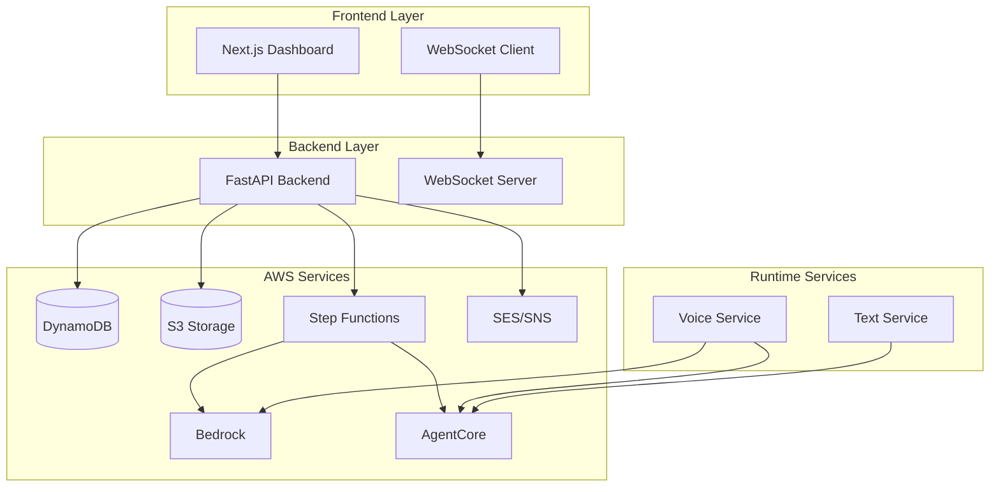

# Design Document

## Overview

Oratio is a multi-tenant SaaS platform that enables enterprises to create, deploy, and manage voice and conversational AI agents without writing code. The platform uses a sophisticated meta-agent architecture where an AgentCreator agent automatically designs, implements, reviews, and deploys custom agents based on user-provided SOPs and knowledge bases.

The system follows a three-tier architecture with a Next.js frontend, FastAPI backend, and AWS services layer. The core innovation lies in the AgentCreator meta-agent that transforms business requirements into production-ready AgentCore agents with full voice and text capabilities.

## Architecture

### System Architecture Overview

The platform is built on a three-tier architecture:

1. **Presentation Tier**: Next.js 14 frontend with TypeScript
2. **Application Tier**: FastAPI backend with Python
3. **Data & Service Tier**: AWS services (DynamoDB, S3, Lambda, Bedrock, AgentCore)

### High-Level Component Diagram



### Authentication & Multi-Tenancy Architecture

The system uses AWS Cognito for authentication with strict tenant isolation:

- **User Pool**: Manages user registration, login, and JWT token issuance
- **JWT Validation**: All API requests validate Cognito tokens
- **Tenant Isolation**: userId from JWT claims enforces data boundaries
- **Resource Scoping**: All DynamoDB queries and S3 operations include userId

## Components and Interfaces

### Frontend Components

#### 1. Authentication Module
- **Login/Register Pages**: Cognito integration with email verification
- **JWT Token Management**: Automatic refresh and storage
- **Route Protection**: Guards for authenticated routes

#### 2. Agent Management Module
- **Agent Creation Wizard**: Multi-step form for SOP, documents, and configuration
- **Agent List View**: Display all user agents with status and metrics
- **Agent Detail View**: Configuration management and endpoint information

#### 3. Session Monitoring Module
- **Live Sessions Dashboard**: Real-time view of active conversations
- **Session History**: Searchable archive with filtering capabilities
- **Session Detail View**: Complete transcript and audio playback

#### 4. Notification Center
- **Real-time Alerts**: WebSocket-powered handoff notifications
- **Notification Management**: Mark as read/acknowledged functionality
- **Email Integration**: SES-powered email notifications

#### 5. API Key Management
- **Key Generation**: Secure API key creation with one-time display
- **Key Listing**: Metadata view without exposing actual keys
- **Key Revocation**: Immediate deactivation capabilities

### Backend Components

#### 1. Authentication Service
```python
class AuthService:
    def register_user(email, password, name, org_name) -> User
    def login_user(email, password) -> TokenResponse
    def validate_jwt(token) -> User
    def refresh_token(refresh_token) -> TokenResponse
```

#### 2. Agent Service
```python
class AgentService:
    def create_agent(user_id, agent_data) -> Agent
    def get_agent(user_id, agent_id) -> Agent
    def list_agents(user_id) -> List[Agent]
    def update_agent(user_id, agent_id, updates) -> Agent
    def delete_agent(user_id, agent_id) -> bool
```

#### 3. Session Service
```python
class SessionService:
    def create_session(agent_id, session_type) -> Session
    def get_active_sessions(user_id) -> List[Session]
    def get_session_history(user_id, filters) -> List[Session]
    def update_session(session_id, updates) -> Session
```

#### 4. Notification Service
```python
class NotificationService:
    def create_notification(user_id, notification_data) -> Notification
    def send_email_notification(user_id, notification) -> bool
    def push_websocket_notification(user_id, notification) -> bool
    def mark_as_read(notification_id) -> bool
```

#### 5. API Key Service
```python
class ApiKeyService:
    def generate_key(user_id, agent_id, key_name) -> ApiKey
    def validate_key(api_key_hash) -> ApiKeyValidation
    def list_keys(user_id, agent_id) -> List[ApiKey]
    def revoke_key(key_id) -> bool
```

### AgentCreator Meta-Agent Architecture

The AgentCreator meta-agent is built using **DSPy + LangGraph** and generates **Strands agents** for deployment:

**DSPy Framework** (https://dspy.ai/docs):
- Provides declarative programming model for LLM pipelines
- Optimizes prompts and weights automatically through compilation
- Enables systematic prompt engineering and evaluation
- Uses Signatures to define input/output behavior
- Supports modules like ChainOfThought, ReAct, and custom compositions

**LangGraph Integration**:
- Orchestrates multi-step agent creation workflow as a StateGraph
- Manages state transitions between pipeline stages
- Provides error handling and retry logic
- Enables cyclic workflows for iterative refinement (plan review cycles)
- Supports conditional edges for quality gates

**Strands Agent Output** (https://strandsagents.com/latest/documentation/docs/):
- Generated agents follow Strands agent framework specification
- Strands provides structured agent architecture with:
  - **Tools**: Function calling capabilities for external actions
  - **Memory**: Persistent state and conversation history
  - **Reasoning**: Multi-step planning and decision-making
- Agents are deployed to AWS AgentCore for production execution
- Compatible with AgentCore's runtime, observability, and security features

**Meta-Agent Pipeline Stages**:
1. **SOP Parser** (DSPy ChainOfThought module): Extracts structured requirements from user SOPs
2. **Plan Drafter** (LangGraph node with DSPy): Creates initial agent architecture plan
3. **Plan Reviewer** (LangGraph cyclic node): Multi-cycle review and refinement (2+ iterations)
4. **Code Generator** (DSPy module): Generates Strands agent Python code with proper structure
5. **Code Reviewer** (LangGraph node with DSPy): Validates generated code quality and best practices
6. **S3 Writer**: Stores agent.py for deployment to AgentCore

**Implementation Benefits**:
- **DSPy**: Systematic prompt optimization reduces manual prompt engineering
- **LangGraph**: Explicit workflow control with state management and error recovery
- **Strands**: Standardized agent structure ensures consistency and maintainability
- **AgentCore**: Enterprise-grade deployment with built-in auth, memory, and observability

### Infrastructure as Code

**AWS CDK with Python**:
All AWS infrastructure is defined using AWS CDK (Cloud Development Kit) with Python, providing:
- **Type-Safe Infrastructure**: Python type hints for better IDE support
- **Language Consistency**: Same language as backend (FastAPI) and meta-agent (DSPy/LangGraph)
- **Reusable Constructs**: Modular stack definitions for DynamoDB, S3, Lambda, Step Functions
- **Automated Deployment**: Single command deployment with `cdk deploy`

**CDK Stack Organization**:
- `DynamoDBStack`: All database tables with GSIs
- `S3Stack`: Knowledge bases, generated code, and recordings buckets
- `LambdaStack`: KB Provisioner, AgentCreator Invoker, AgentCore Deployer
- `StepFunctionsStack`: Agent creation workflow orchestration
- `CognitoStack`: User Pool and authentication configuration

### AWS Service Integration

#### 1. Step Functions Orchestration
The agent creation workflow is orchestrated by Step Functions:

```json
{
  "Comment": "Agent Creation Workflow",
  "StartAt": "KBProvisioner",
  "States": {
    "KBProvisioner": {
      "Type": "Task",
      "Resource": "arn:aws:lambda:region:account:function:KBProvisioner",
      "Next": "AgentCreatorInvoker"
    },
    "AgentCreatorInvoker": {
      "Type": "Task",
      "Resource": "arn:aws:lambda:region:account:function:AgentCreatorInvoker",
      "Next": "WaitForCode"
    },
    "WaitForCode": {
      "Type": "Wait",
      "Seconds": 30,
      "Next": "CheckS3Code"
    },
    "CheckS3Code": {
      "Type": "Task",
      "Resource": "arn:aws:lambda:region:account:function:CheckS3Code",
      "Next": "CodeReady?"
    },
    "CodeReady?": {
      "Type": "Choice",
      "Choices": [
        {
          "Variable": "$.codeReady",
          "BooleanEquals": true,
          "Next": "AgentCoreDeployer"
        }
      ],
      "Default": "WaitForCode"
    },
    "AgentCoreDeployer": {
      "Type": "Task",
      "Resource": "arn:aws:lambda:region:account:function:AgentCoreDeployer",
      "End": true
    }
  }
}
```

#### 2. Lambda Functions

**KB Provisioner Lambda**:
- Creates Bedrock Knowledge Base
- Configures S3 data source
- Initiates document ingestion
- Updates agent metadata in DynamoDB

**AgentCreator Invoker Lambda**:
- Retrieves agent SOP from DynamoDB
- Invokes AgentCreator meta-agent via AgentCore
- Passes SOP and Knowledge Base ID
- Monitors meta-agent execution

**AgentCore Deployer Lambda**:
- Retrieves generated agent code from S3
- Deploys agent to AgentCore
- Configures agent endpoints
- Updates agent status to "active"

#### 3. Voice and Text Runtime Services

**Voice Service Architecture**:
```python
class VoiceService:
    def __init__(self):
        self.nova_sonic = NovaSonicClient()
        self.agentcore = AgentCoreClient()
        
    async def handle_websocket(websocket, agent_id, api_key):
        # Authenticate API key
        # Create session
        # Initialize audio streaming
        # Process audio loop
        # Save transcript and recording
```

**Text Service Architecture**:
```python
class TextService:
    def __init__(self):
        self.agentcore = AgentCoreClient()
        
    async def handle_chat(agent_id, message, session_id, api_key):
        # Authenticate API key
        # Get/create session
        # Invoke AgentCore agent
        # Check handoff conditions
        # Return response with sources
```

## Data Models

### User Model
```python
@dataclass
class User:
    user_id: str
    email: str
    password_hash: str
    name: str
    organization_name: str
    created_at: int
    last_login: int
    subscription_tier: str
```

### Agent Model
```python
@dataclass
class Agent:
    user_id: str
    agent_id: str
    agent_name: str
    agent_type: str  # voice|text|both
    sop: str
    voice_config: Dict
    text_config: Dict
    knowledge_base_id: str
    knowledge_base_arn: str
    agentcore_agent_id: str
    agentcore_agent_arn: str
    human_handoff_enabled: bool
    human_handoff_conditions: List[str]
    status: Literal['creating','active','failed','paused']  # creating|active|failed|paused
    created_at: int
    updated_at: int
    websocket_url: str
    api_endpoint: str
```

### Session Model
```python
@dataclass
class Session:
    session_id: str
    agent_id: str
    user_id: str
    session_type: str  # voice|text
    status: str  # active|completed|handoff_requested|error
    start_time: int
    end_time: int
    duration: int
    message_count: int
    transcript: List[Dict]
    audio_recording_url: str
    handoff_requested: bool
    handoff_reason: str
    customer_metadata: Dict
```

### API Key Model
```python
@dataclass
class ApiKey:
    api_key_hash: str
    user_id: str
    agent_id: str
    key_name: str
    created_at: int
    expires_at: int
    last_used_at: int
    usage_count: int
    is_active: bool
```

### Notification Model
```python
@dataclass
class Notification:
    notification_id: str
    user_id: str
    agent_id: str
    session_id: str
    type: str
    status: str
    priority: str
    message: str
    metadata: Dict
    email_sent: bool
    created_at: int
```

## Error Handling

### Error Categories

1. **Authentication Errors**
   - Invalid credentials (401)
   - Expired tokens (401)
   - Insufficient permissions (403)

2. **Validation Errors**
   - Invalid input data (400)
   - Missing required fields (400)
   - File upload errors (400)

3. **Resource Errors**
   - Agent not found (404)
   - Session not found (404)
   - API key not found (404)

4. **Service Errors**
   - AWS service failures (500)
   - Database connection errors (500)
   - Step Functions execution failures (500)

5. **Rate Limiting**
   - Too many requests (429)
   - API key usage limits (429)

### Error Response Format

```json
{
  "error": {
    "code": "AGENT_NOT_FOUND",
    "message": "The specified agent could not be found",
    "details": {
      "agent_id": "123e4567-e89b-12d3-a456-426614174000"
    },
    "timestamp": "2024-01-15T10:30:00Z",
    "request_id": "req_123456789"
  }
}
```

### Error Handling Strategy

1. **Graceful Degradation**: Non-critical features fail silently
2. **Retry Logic**: Automatic retries for transient failures
3. **Circuit Breakers**: Prevent cascade failures
4. **Logging**: Comprehensive error logging with correlation IDs
5. **User Feedback**: Clear, actionable error messages

## Testing Strategy

### Unit Testing

**Backend Services**:
- Service layer unit tests with mocked dependencies
- Model validation and serialization tests
- Utility function tests
- AWS client wrapper tests

**Frontend Components**:
- Component rendering tests with React Testing Library
- Hook behavior tests
- API client tests with mocked responses
- Form validation tests

### Integration Testing

**API Integration**:
- End-to-end API workflow tests
- Database integration tests
- AWS service integration tests
- WebSocket connection tests

**Frontend Integration**:
- User journey tests with Playwright
- API integration tests
- WebSocket integration tests
- File upload tests

### System Testing

**Agent Creation Workflow**:
- Complete agent creation pipeline test
- Step Functions execution tests
- AgentCreator meta-agent integration tests
- Error handling and recovery tests

**Voice and Text Services**:
- WebSocket connection and audio streaming tests
- REST API conversation flow tests
- Session management tests
- Handoff detection tests

### Performance Testing

**Load Testing**:
- Concurrent user simulation
- API endpoint load testing
- WebSocket connection scaling
- Database query performance

**Stress Testing**:
- High-volume agent creation
- Concurrent session handling
- Memory and CPU usage monitoring
- AWS service limits testing

### Security Testing

**Authentication Testing**:
- JWT token validation
- Session management security
- Password security requirements
- Multi-tenant isolation

**API Security**:
- API key validation
- Input sanitization
- SQL injection prevention
- Cross-site scripting (XSS) prevention

**Infrastructure Security**:
- AWS IAM role testing
- S3 bucket policy validation
- DynamoDB access control
- Network security testing

### Test Data Management

**Test Fixtures**:
- User account fixtures
- Agent configuration fixtures
- Session data fixtures
- Notification fixtures

**Data Cleanup**:
- Automated test data cleanup
- Isolated test environments
- Database state management
- S3 test bucket management

### Continuous Integration

**Automated Testing Pipeline**:
1. Unit tests on every commit
2. Integration tests on pull requests
3. System tests on staging deployment
4. Performance tests on release candidates

**Test Coverage Requirements**:
- Minimum 80% code coverage for backend
- Minimum 70% code coverage for frontend
- 100% coverage for critical security functions
- Integration test coverage for all API endpoints

### Frontend Design System

#### Core Identity
Oratio embodies a "confident, elegant, forward-thinking" personality as an AI voice agent platform. The design is professional yet friendly, avoiding typical "big tech neutral" aesthetics.

**Brand Tagline**: "AI-Architected Voice Agents for Modern Enterprises"

#### Visual Language
- **Futuristic with Classical Elements**: Abstract Greek/Roman shapes integrated subtly
- **Organic Flow Design**: Gentle curves and flowing forms - NO boxes or rigid grid layouts
- **Soft Gradients**: Fluid forms throughout the interface
- **Voice-Centric Iconography**: Waveforms, speech ribbons, agent clusters

#### Color System
```css
/* Primary Colors */
--primary-blue: #1A244B;        /* Deep sapphire blue */
--accent-orange: #FFB76B;       /* Muted sunrise orange */
--supporting-white: #FFFFFF;
--supporting-gray: #F5F5F5;
--highlight-violet: #8B5CF6;

/* NO dark/black backgrounds */
```

#### Typography & UI Components
- **Font Family**: Modern elegant sans-serif (Inter/Sofia Pro style)
- **Component Style**: Rounded, fluid components with signature "Oratio arch" motif
- **Interactions**: Glowing microinteractions and floating elements
- **Accessibility**: Accessible but not minimalist approach

#### Brand Voice & Messaging
- **Empathetic Communication**: "Speaks with empathy" approach
- **Invitational CTAs**: "Start your conversation" vs "Click here"
- **Conversational Feel**: Everything feels "spoken, not clicked"

#### Strict Design Avoids
- Stock human photos, chat bubbles, robot iconography
- Material Design defaults, hard edges, grid systems
- Abrupt interactions - all feedback is smooth/fading

#### Signature Design Elements
- **Pill-shaped Buttons**: Rounded, floating components throughout
- **Animated Voice Waveforms**: Core visual metaphor for voice interactions
- **Consistent Arch Motif**: Rounded/arched corners across all UI elements
- **Gentle Effects**: Ripple effects and glowing hover states

#### Implementation Guidelines
```scss
// Signature button style
.oratio-button {
  border-radius: 50px;
  background: linear-gradient(135deg, var(--primary-blue), var(--highlight-violet));
  box-shadow: 0 4px 20px rgba(26, 36, 75, 0.3);
  transition: all 0.3s ease;
  
  &:hover {
    transform: translateY(-2px);
    box-shadow: 0 8px 30px rgba(26, 36, 75, 0.4);
  }
}

// Voice waveform animation
.voice-waveform {
  animation: pulse 2s ease-in-out infinite;
  filter: drop-shadow(0 0 10px var(--accent-orange));
}
```

This design philosophy positions Oratio as a luxury audio product rather than a typical chatbot builder, with every interaction designed to feel conversational and empathetic.

### Monitoring and Observability

**Application Monitoring**:
- CloudWatch metrics and alarms
- Custom business metrics
- Error rate monitoring
- Performance metrics

**Logging Strategy**:
- Structured logging with correlation IDs
- Centralized log aggregation
- Log retention policies
- Security event logging

**Health Checks**:
- Service health endpoints
- Database connectivity checks
- AWS service availability checks
- External dependency monitoring