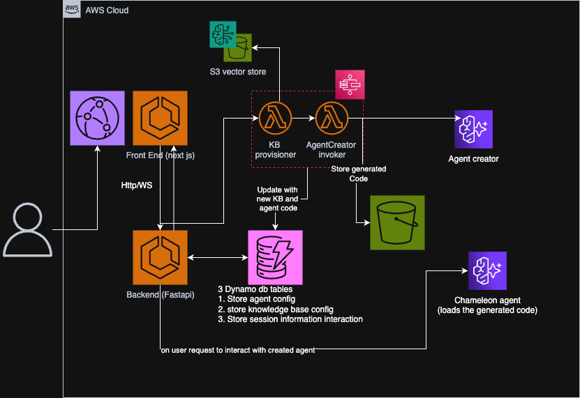
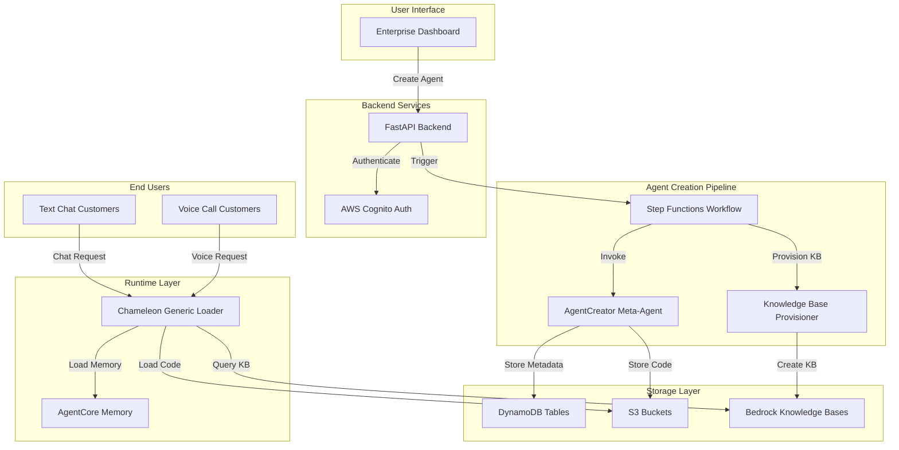
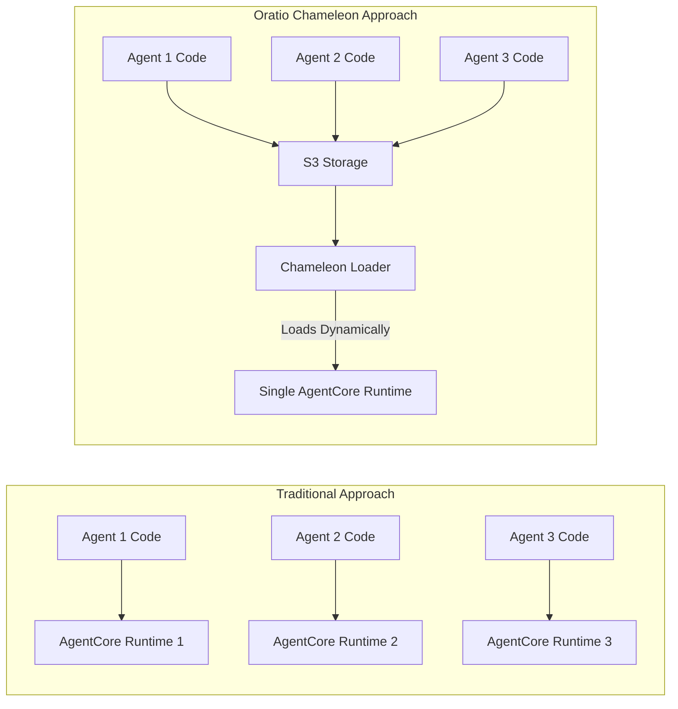
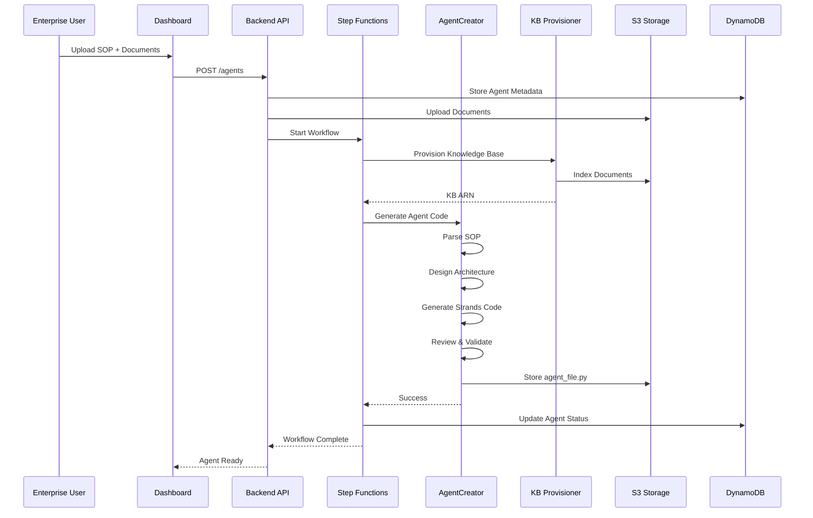
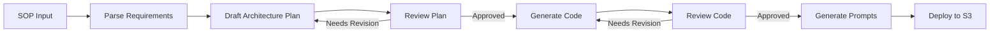
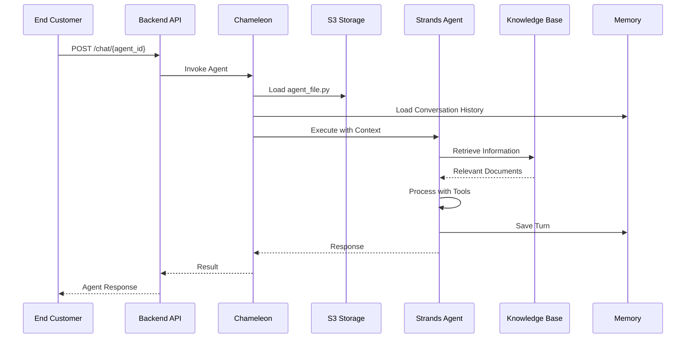
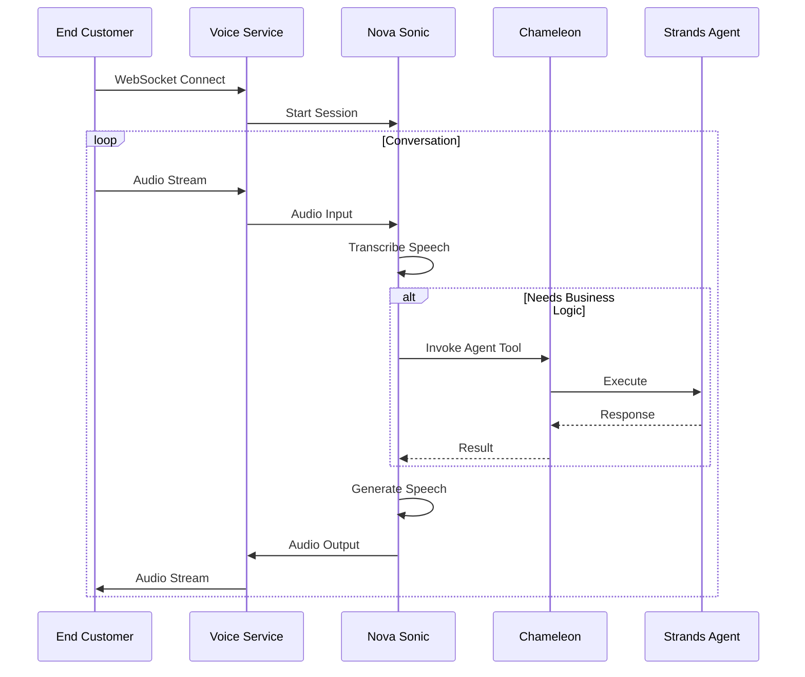
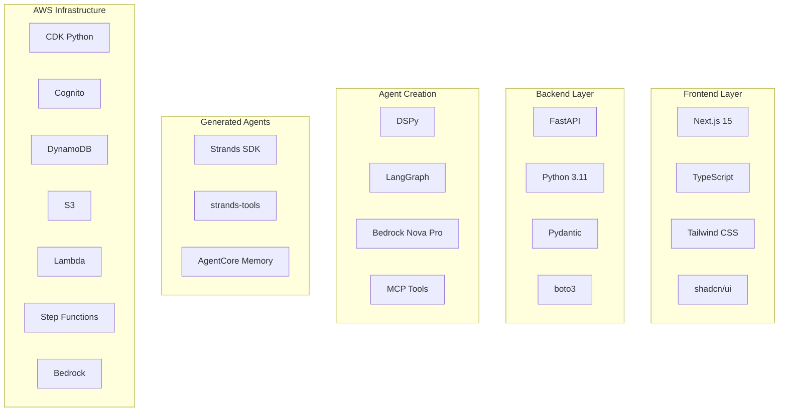
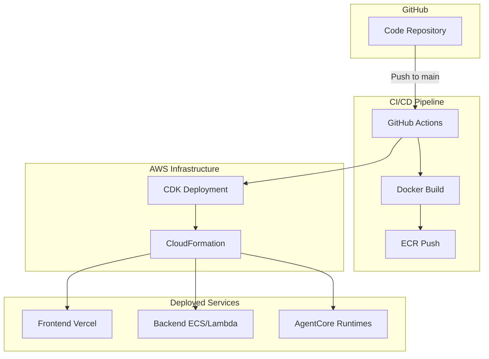

# Oratio Platform

**AI-Powered Voice & Text Agent Platform for Enterprises**

Build, deploy, and manage conversational AI agents in minutes—not months. Simply provide your SOPs and knowledge base, and Oratio automatically generates production-ready agents.

---

## 📖 Quick Navigation

| Topic | Description |
|-------|-------------|
| [🤖 AgentCreator Pipeline](docs/AGENT_CREATOR.md) | How the meta-agent generates custom agents |
| [🎙️ Voice Agents](docs/VOICE_AGENTS.md) | How voice agents work with AWS Nova Sonic |
| [🚀 Deployment](docs/DEPLOYMENT.md) | Infrastructure setup and CI/CD pipeline |
| [🏗️ Architecture](docs/ORATIO_ARCHITECTURE.md) | Detailed system design |

---

## 🎯 What is Oratio?

Oratio is a **multi-tenant SaaS platform** that enables enterprises to create AI agents without writing code. The platform consists of three main components:

1. **Frontend Dashboard** - Next.js application for agent management
2. **Backend API** - FastAPI service handling authentication and orchestration
3. **Agent Infrastructure** - AWS-based agent creation and runtime system

### **The Problem We Solve**

Traditional AI agent deployment requires:
- Manual coding for each agent
- Separate infrastructure per agent
- Complex deployment pipelines
- Weeks of development time

### **Our Solution**

Oratio automates the entire process:
- Upload SOP + knowledge base documents
- AgentCreator meta-agent generates custom code
- Chameleon runtime loads agents dynamically
- Deploy unlimited agents with one infrastructure

---

## 🏗️ System Architecture

### **High-Level Flow**

### **Key Innovation: Chameleon Architecture**

Traditional approach: **One AgentCore deployment per agent** (slow, expensive)

Oratio approach: **One generic loader for unlimited agents**

**Benefits:**
- ✅ Sub-second agent creation (no deployment wait)
- ✅ Cost-effective scaling (one runtime for all agents)
- ✅ Per-agent memory isolation
- ✅ Instant updates (just update S3 code)

---

## 🔄 Agent Creation Workflow

### **AgentCreator Pipeline (DSPy + LangGraph)**

The meta-agent that generates custom agents:

**Pipeline Stages:**
1. **SOP Parser** - Extracts business rules and requirements
2. **Plan Drafter** - Designs single or multi-agent architecture
3. **Plan Reviewer** - Validates architecture (up to 3 iterations)
4. **Code Generator** - Writes production-ready Strands agent code
5. **Code Reviewer** - Validates syntax and best practices
6. **Prompt Generator** - Creates optimized system prompts

---

## 💬 Runtime Execution Flow

### **Text Chat**

### **Voice Calls**

---

## ✨ Key Features

### **1. No-Code Agent Creation**
- Upload SOP and knowledge base documents
- AgentCreator automatically designs optimal architecture
- Generates production-ready code in seconds
- No manual coding or deployment required

### **2. Intelligent Meta-Agent (AgentCreator)**
- **DSPy Framework** - Optimized LLM prompting
- **LangGraph Orchestration** - Multi-stage pipeline with quality gates
- **MCP Tools** - Accesses Strands and AgentCore documentation
- **Iterative Refinement** - Reviews and improves generated code
- **Multi-Agent Support** - Generates single or multi-agent architectures

### **3. Dynamic Runtime (Chameleon)**
- **Generic Loader** - One deployment for unlimited agents
- **S3-Based Loading** - Loads agent code on-demand
- **Memory Injection** - Automatic conversation history
- **Session Isolation** - Per-agent, per-customer separation

### **4. Dual Interaction Modes**
- **Text Chat** - REST API for web/mobile applications
- **Voice Calls** - WebSocket + AWS Nova Sonic for phone calls
- **Unified Backend** - Same agent code for both modes

### **5. Enterprise-Grade Memory**
- **AgentCore Memory API** - Persistent conversation history
- **Automatic Context Loading** - Last 10 turns loaded on init
- **Multi-Session Support** - Multiple conversations per customer
- **30-Day Retention** - Configurable retention policies

### **6. Multi-Tenant Architecture**
- **User Isolation** - Strict tenant separation in DynamoDB
- **API Key Management** - Scoped keys per agent
- **Cognito Authentication** - Secure user management
- **Role-Based Access** - CHAT, VOICE, ADMIN permissions

---

## 🛠️ Technology Stack

| Layer | Technologies |
|-------|-------------|
| **Frontend** | Next.js 15, TypeScript, Tailwind CSS, shadcn/ui |
| **Backend** | FastAPI, Python 3.11, Pydantic, boto3 |
| **Agent Creation** | DSPy, LangGraph, Bedrock Nova Pro, MCP Tools |
| **Generated Agents** | Strands SDK, strands-tools, AgentCore Memory |
| **Infrastructure** | AWS CDK, Cognito, DynamoDB, S3, Lambda, Step Functions |
| **LLM Models** | Nova Pro (text), Nova Sonic (voice), Claude (fallback) |
| **CI/CD** | GitHub Actions, Docker, ECR |

---

## 📊 Project Components

### **Frontend Dashboard**
- User authentication and registration
- Agent creation wizard
- Knowledge base management
- API key generation
- Session monitoring (future)

### **Backend API**
- RESTful endpoints for agent management
- Cognito integration for authentication
- JWT token validation
- WebSocket support for voice (future)
- Chat endpoint with API key validation

### **Agent Creator (Meta-Agent)**
- DSPy-powered code generation
- LangGraph workflow orchestration
- MCP documentation tools
- Syntax validation
- Multi-agent pattern support

### **Chameleon (Generic Loader)**
- Dynamic agent code loading from S3
- Memory hook injection
- Session state management
- Tool execution environment

### **Infrastructure (AWS CDK)**
- DynamoDB tables (users, agents, knowledge bases, API keys)
- S3 buckets (documents, generated code)
- Lambda functions (KB provisioner, AgentCreator invoker)
- Step Functions (agent creation workflow)
- Cognito User Pool (authentication)
- IAM roles and policies

---

## 🚀 Deployment Architecture

**Deployment Process:**
1. Code pushed to GitHub main branch
2. GitHub Actions triggers CI/CD pipeline
3. Docker images built for backend and agent services
4. Images pushed to AWS ECR
5. CDK deploys infrastructure (DynamoDB, S3, Lambda, etc.)
6. AgentCore runtimes deployed (Chameleon, AgentCreator)
7. Frontend deployed to Vercel/Amplify

---

## 🔒 Security & Compliance

- **Authentication** - AWS Cognito with JWT tokens
- **Authorization** - API keys with scoped permissions
- **Data Isolation** - Multi-tenant DynamoDB design
- **Encryption** - S3 encryption at rest, TLS in transit
- **Secrets Management** - AWS Secrets Manager
- **Audit Logging** - CloudWatch Logs and X-Ray tracing
- **CORS** - Configured for production origins only

---

## 📈 Scalability

- **Horizontal Scaling** - Chameleon handles concurrent requests
- **Cost Optimization** - Pay-per-invocation model
- **Memory Efficiency** - Shared runtime for all agents
- **Storage** - S3 for unlimited agent code storage
- **Database** - DynamoDB on-demand scaling

---

## 📊 Current Status

**Phase:** MVP Development 

**Completed:**
- ✅ Frontend dashboard with authentication
- ✅ Backend API with Cognito integration
- ✅ AgentCreator meta-agent pipeline
- ✅ Chameleon generic loader
- ✅ AWS infrastructure (CDK)
- ✅ CI/CD pipeline (GitHub Actions)
- ✅ Text chat functionality
- ✅ Conversation memory system
- ✅ Voice agent integration (Nova Sonic)

**In Progress:**
- 🚧 Realtime call client transcriptions
- 🚧 Analytics dashboard

---

## 📚 Additional Documentation

- **[AgentCreator Pipeline](docs/AGENT_CREATOR.md)** - Meta-agent workflow and LangGraph orchestration
- **[Voice Agents](docs/VOICE_AGENTS.md)** - Detailed voice agent architecture

---

