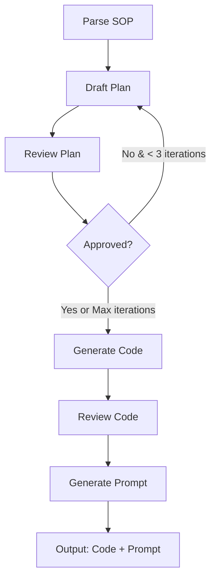

# Oratio AgentCreator - Complete System Architecture

## Table of Contents
1. [System Overview](#system-overview)
2. [AgentCreator Pipeline](#agentcreator-pipeline)
3. [Two-Tier Agent Architecture](#two-tier-agent-architecture)
4. [Interaction Modes](#interaction-modes)
5. [Data Model](#data-model)
6. [Deployment Flow](#deployment-flow)

---

## System Overview

Oratio is a platform that transforms Standard Operating Procedures (SOPs) into production-ready AI agents. The system consists of:

1. **AgentCreator Pipeline** - Meta-agent that generates custom agents from SOPs
2. **Generated Agents** - Business logic agents deployed on AWS Bedrock AgentCore
3. **Voice Service** - WebSocket service for voice interactions using Nova Sonic
4. **Text Service** - REST API for text-based interactions

### High-Level Architecture

```
User uploads SOP
    ↓
AgentCreator Pipeline (DSPy + LangGraph)
    - Parses SOP
    - Drafts architecture plan
    - Generates Strands agent code
    - Creates system prompt
    ↓
Deploy to AWS Bedrock AgentCore
    ↓
Two Interaction Modes:
    1. Text Chat (REST API)
    2. Voice Chat (WebSocket + Nova Sonic)
```

---

## AgentCreator Pipeline

### Overview

AgentCreator is a meta-agent that combines **DSPy** for LLM-powered reasoning and **LangGraph** for workflow orchestration to generate production-ready Strands agents.

### Pipeline Stages



### DSPy Module Selection

| Module | Type | Rationale |
|--------|------|-----------|
| **SOPParser** | ChainOfThought | Pure reasoning - extracts structured requirements from SOP |
| **PlanDrafter** | ChainOfThought | Systematic planning - creates agent architecture |
| **PlanReviewer** | ChainOfThought | Critique and analysis - reviews plan quality |
| **CodeGenerator** | **ReAct** | **Code generation with validation** - uses tools for testing |
| **CodeReviewer** | ChainOfThought | Code analysis - reviews generated code |
| **PromptGenerator** | ChainOfThought | Prompt crafting - creates system prompts |

### Why ReAct for CodeGenerator?

**ReAct (Reasoning + Acting)** enables the CodeGenerator to:
- Validate code syntax during generation
- Execute code snippets for testing
- Iterate based on tool feedback
- Ensure production-ready code

**Available Tools**:
1. `validate_python_syntax` - Fast AST-based validation
2. `execute_python_code` - Full execution testing
3. `search_docs` - Search Strands documentation (MCP)
4. `fetch_doc` - Fetch detailed documentation (MCP)
5. AWS documentation tools - Search AWS Bedrock AgentCore docs (MCP)

### MCP Integration

The CodeGenerator has access to two MCP servers:

1. **Strands MCP Server** - Strands agent framework documentation
2. **AWS Documentation MCP Server** - AWS Bedrock AgentCore documentation

This ensures generated code follows official patterns and best practices.

### Example ReAct Flow

```
Thought: I need to generate a Strands agent with knowledge base integration
Action: search_docs(query="retrieve tool usage", k=3)
Observation: Found documentation on retrieve tool configuration
Thought: Now I'll generate the agent code with retrieve tool
Action: validate_python_syntax(draft_code)
Observation: ✓ Code syntax is valid
Thought: Let me verify the tool configuration structure
Action: search_docs(query="tool_config structure", k=2)
Observation: Found correct tool_config format
Final Answer: [Complete validated code]
```

### Pipeline Output

```python
{
    "agent_code": "from bedrock_agentcore.runtime import BedrockAgentCoreApp...",
    "generated_prompt": "You are a friendly customer service agent...",
    "requirements": {...},
    "plan": {...}
}
```

---

## Two-Tier Agent Architecture

### Overview

Oratio uses a sophisticated two-tier architecture where a **voice agent** (Nova Sonic) invokes a **business logic agent** (generated from SOP) as a tool.

### Architecture Diagram

```
┌─────────────────────────────────────────────────────────────────┐
│                        User (Browser/Phone)                      │
└────────────────────────────┬────────────────────────────────────┘
                             │ WebSocket (Audio)
                             ↓
┌─────────────────────────────────────────────────────────────────┐
│                   FastAPI voice_service                          │
│  - WebSocket handler                                             │
│  - Audio encoding/decoding                                       │
└────────────────────────────┬────────────────────────────────────┘
                             │ Bidirectional Stream
                             ↓
┌─────────────────────────────────────────────────────────────────┐
│              AWS Bedrock Nova Sonic (Tier 1)                     │
│  - Speech-to-text                                                │
│  - Conversation management                                       │
│  - Personality & tone                                            │
│  - Text-to-speech                                                │
│                                                                   │
│  Tools Available:                                                │
│  ┌────────────────────────────────────────────────────────────┐ │
│  │  invoke_business_agent(query: str) -> dict                 │ │
│  │  - Invokes Tier 2 agent for business logic                 │ │
│  └────────────────────────────────────────────────────────────┘ │
└────────────────────────────┬────────────────────────────────────┘
                             │ invoke_agent()
                             ↓
┌─────────────────────────────────────────────────────────────────┐
│         AWS Bedrock AgentCore (Tier 2)                           │
│  Generated Strands Agent from SOP                                │
│  - Knowledge base queries                                        │
│  - SOP business rules                                            │
│  - Escalation logic                                              │
│  - Structured decision making                                    │
└─────────────────────────────────────────────────────────────────┘
```

### Tier 1: Voice Agent (Nova Sonic)

**Responsibilities**:
- Voice interaction (speech-to-text, text-to-speech)
- Conversation flow management
- Personality and tone
- Tool orchestration (decides when to invoke Tier 2)

**System Prompt** (from `generatedPrompt` in DynamoDB):
```
You are a friendly customer service voice agent for [Company Name].

Your personality:
- Warm and professional
- Patient and helpful
- Moderate enthusiasm

When a customer asks a question:
1. Listen carefully to their request
2. Use the invoke_business_agent tool to get the answer
3. Present the answer naturally and conversationally
4. Ask follow-up questions if needed
```

### Tier 2: Business Logic Agent (Generated from SOP)

**Responsibilities**:
- Knowledge base access
- SOP business rules application
- Escalation logic
- Structured decision making

**Generated Code Structure**:
```python
from bedrock_agentcore.runtime import BedrockAgentCoreApp
from bedrock_agentcore.memory import MemoryClient
from strands_agents import Agent
from strands_agents_tools import retrieve, handoff_to_user

app = BedrockAgentCoreApp()

SYSTEM_PROMPT = """
You are a business logic agent for customer service.
- Answer questions using the knowledge base
- Apply company policies from the SOP
- Determine when escalation is needed
"""

agent = Agent(
    system_prompt=SYSTEM_PROMPT,
    tools=[retrieve, handoff_to_user],
    tool_config={
        "retrieve": {"knowledge_base_id": "kb-xxx"}
    }
)

@app.entrypoint
def invoke(payload: dict) -> dict:
    """Invoked by Nova Sonic as a tool"""
    query = payload.get("prompt")
    
    # Load conversation history from AgentCore Memory
    memory_client = MemoryClient(region_name="us-east-1")
    # ... memory loading logic ...
    
    # Process query with business logic
    result = agent(query)
    
    # Save conversation turn
    # ... memory saving logic ...
    
    # Return structured response
    return {
        "answer": result.message,
        "requires_escalation": False,
        "confidence": "high"
    }

if __name__ == "__main__":
    app.run()
```

### Benefits of Two-Tier Architecture

1. **Separation of Concerns**
   - Voice layer handles conversation UX
   - Business layer handles domain logic

2. **Flexibility**
   - Update business logic without changing voice agent
   - Update voice personality without changing business rules
   - Test business logic independently

3. **Scalability**
   - Voice agent handles many concurrent conversations
   - Business agent can be scaled independently

4. **Maintainability**
   - SOP changes only affect Tier 2
   - Voice personality changes only affect Tier 1

---

## Interaction Modes

### Mode 1: Text Chat (REST API)

**Endpoint**: `POST /agents/chat/{agent_id}/{actor_id}/{session_id}`

**Authentication**: API Key (X-API-Key header)

**Flow**:
```
Client (Web/Mobile App)
    ↓ HTTP POST with API Key
FastAPI Backend (text_service)
    ↓ Validate API Key from DynamoDB
    ↓ invoke_agent()
AWS Bedrock AgentCore Runtime
    ↓ Invokes deployed agent
Generated Strands Agent
    - Loads conversation history
    - Queries knowledge base
    - Applies SOP rules
    - Returns response
    ↑
FastAPI Backend
    ↑ JSON response
Client receives text response
```

**Request**:
```json
{
  "message": "Can I return this item?"
}
```

**Response**:
```json
{
  "result": "Yes, you can return items within 30 days with a receipt.",
  "stop_reason": "end_turn",
  "metrics": {
    "conversation_turns": 5
  }
}
```

### Mode 2: Voice Chat (WebSocket + Nova Sonic)

**Endpoint**: `WS /voicechat/{agent_id}/{actor_id}/{session_id}`

**Authentication**: API Key (query parameter)

**Flow**:
```
Client (Browser/Phone)
    ↓ WebSocket connection + audio stream
FastAPI Backend (voice_service)
    ↓ Bidirectional streaming
AWS Bedrock Nova Sonic (Tier 1)
    - Speech-to-text
    - Uses generatedPrompt for personality
    - Has invoke_business_agent tool
    ↓ When business logic needed
    ↓ invoke_agent() as tool
AWS Bedrock AgentCore (Tier 2)
    ↓ Invokes deployed agent
Generated Strands Agent
    - Queries knowledge base
    - Applies SOP rules
    - Returns structured decision
    ↑ Returns to Nova Sonic
Nova Sonic
    - Formats response conversationally
    - Converts to speech
    ↑ Streams audio back
FastAPI Backend
    ↑ WebSocket audio stream
Client hears response
```

**Key Point**: Nova Sonic invokes the generated agent as a **tool**, not directly. This enables the two-tier pattern.

---

## Data Model

### DynamoDB Tables

#### agents Table
```python
{
  "userId": "user-123",                    # PK
  "agentId": "agent-456",                  # SK
  "name": "Customer Service Agent",
  "status": "active",                      # creating, active, failed
  "agentCodeS3Path": "s3://bucket/user-123/agent-456/agent_file.py",
  "generatedPrompt": "You are a friendly...",  # Used by Nova Sonic
  "agentCoreId": "agentcore-789",         # Deployed agent ID
  "agentCoreAliasId": "production",
  "bedrockKnowledgeBaseId": "kb-xxx",
  "voicePersonality": {
    "identity": "Friendly customer service rep",
    "tone": "warm and professional",
    "formality": "professional",
    "enthusiasm": "moderate"
  },
  "createdAt": 1234567890,
  "updatedAt": 1234567890
}
```

#### api-keys Table
```python
{
  "apiKeyHash": "sha256-hash",            # PK
  "userId": "user-123",
  "agentId": "agent-456",
  "keyName": "Production Key",
  "permissions": ["chat", "voice"],
  "rateLimit": 1000,
  "createdAt": 1234567890
}
```

---

## Deployment Flow

### Complete Agent Creation Pipeline

```
1. User uploads SOP via frontend
   ↓
2. Backend creates agent record (status: "creating")
   ↓
3. Step Functions workflow starts
   ↓
4. Lambda: KB Provisioner
   - Creates Bedrock Knowledge Base
   - Uploads documents to S3
   - Starts ingestion job
   ↓
5. Lambda: AgentCreator Invoker
   - Invokes AgentCreator meta-agent on AgentCore
   - Receives generated agent code + system prompt
   - Stores code in S3
   - Stores prompt in DynamoDB
   ↓
6. Lambda: AgentCore Deployer
   - Deploys generated agent to AgentCore
   - Creates agent alias
   - Returns agent ID
   ↓
7. Update agent record (status: "active")
   ↓
8. User can now:
   - Generate API keys
   - Use text chat: POST /agents/chat/{agent_id}/{actor_id}/{session_id}
   - Use voice chat: WS /voicechat/{agent_id}/{actor_id}/{session_id}
```

### Lambda: AgentCreator Invoker

**Purpose**: Invokes the AgentCreator meta-agent to generate custom agent code and system prompt from SOP.

**Input**:
```json
{
  "userId": "user-123",
  "agentId": "agent-456",
  "bedrockKnowledgeBaseId": "kb-xxx",
  "sop": "You are a customer service agent...",
  "knowledgeBaseDescription": "Use KB for product info",
  "humanHandoffDescription": "Escalate complaints and refunds over $100"
}
```

**Process**:
1. Retrieve voice personality from DynamoDB
2. Prepare input for AgentCreator meta-agent
3. Invoke AgentCreator via Bedrock Agent Runtime
4. Parse response (agent_code + generated_prompt)
5. Upload code to S3
6. Update DynamoDB with agentCodeS3Path and generatedPrompt
7. Return to Step Functions for deployment

**Output**:
```json
{
  "userId": "user-123",
  "agentId": "agent-456",
  "codeS3Path": "s3://bucket/user-123/agent-456/agent_file.py",
  "generatedPrompt": "You are a friendly...",
  "bedrockKnowledgeBaseId": "kb-xxx"
}
```

---

## Key Design Decisions

### 1. Generated Prompt Storage
**Decision**: Store `generatedPrompt` in DynamoDB agents table

**Rationale**:
- Nova Sonic needs the personality/behavior prompt
- Prompt is generated by AgentCreator pipeline
- Easy to retrieve when initializing voice sessions
- Can be updated without redeploying agent

### 2. Two-Tier Agent Architecture
**Decision**: Nova Sonic (Tier 1) invokes generated agent (Tier 2) as tool

**Rationale**:
- Separation of concerns (voice vs business logic)
- Business logic can be updated independently
- Same agent code works for both text and voice
- Nova Sonic handles conversation UX
- Generated agent handles domain logic

### 3. Dual Interaction Modes
**Decision**: Support both REST API (text) and WebSocket (voice)

**Rationale**:
- Different use cases (chat apps vs voice calls)
- Same underlying agent for consistency
- API keys control access to both modes
- Flexibility for customers

### 4. AgentCore Memory Integration
**Decision**: Use AgentCore Memory for conversation persistence

**Rationale**:
- Built-in conversation continuity
- Handles multi-turn context automatically
- Scales with AgentCore infrastructure
- Consistent across text and voice modes

### 5. MCP Documentation Access
**Decision**: Provide Strands and AWS documentation via MCP servers

**Rationale**:
- Ensures generated code follows official patterns
- Reduces hallucination and incorrect implementations
- Keeps code up-to-date with latest best practices
- Enables self-correction during generation

---

## Performance Considerations

### AgentCreator Pipeline Latency

| Stage | Typical Duration | Bottleneck |
|-------|-----------------|------------|
| Parse SOP | 2-5s | LLM inference |
| Draft Plan | 3-7s | LLM inference |
| Review Plan | 2-4s per iteration | LLM inference |
| Generate Code | 10-20s | LLM + tool calls |
| Review Code | 3-5s | LLM inference |
| Generate Prompt | 2-4s | LLM inference |
| **Total** | **25-50s** | - |

### Optimization Strategies

1. **Parallel Tool Calls** - ReAct can make multiple tool calls in parallel
2. **Session Reuse** - Avoid session creation overhead
3. **Fast Syntax Validation** - Use AST before expensive execution
4. **MCP Tool Caching** - Cache documentation lookups
5. **Async Pipeline** - All DSPy modules use async `aforward()`

---

## Security Considerations

### Code Interpreter Sandbox
- Network isolation (SANDBOX mode)
- Resource limits (2GB memory)
- IAM role with minimal permissions
- Automatic session cleanup

### Input Validation
- SOP sanitization
- Automated code review
- Syntax validation prevents code injection

### API Key Management
- SHA-256 hashed storage
- Per-agent permissions
- Rate limiting
- Expiration support

---

## Next Steps

### Completed ✅
1. AgentCreator pipeline working
2. Generated code structure defined
3. System prompt generation implemented
4. MCP integration (Strands + AWS docs)
5. Async DSPy modules
6. Code generation improvements

### In Progress 🔄
1. Implement text_service REST API
2. Implement voice_service WebSocket
3. Integrate Nova Sonic bidirectional streaming
4. Implement tool invocation pattern

### Planned 📋
1. Add API key management endpoints
2. Deploy and test end-to-end
3. Add monitoring and observability
4. Performance optimization
5. Production deployment

---

## References

- **DSPy Documentation**: https://dspy.ai/docs
- **LangGraph Documentation**: https://langgraph.com/
- **AWS Bedrock AgentCore**: https://docs.aws.amazon.com/bedrock-agentcore/
- **Strands Agents**: https://strandsagents.com/
- **Nova Sonic**: AWS Bedrock Nova Sonic Documentation
- **ReAct Paper**: https://arxiv.org/abs/2210.03629

---

## Document History

- **v3.0** - Consolidated architecture documentation (Jan 2025)
- **v2.0** - Added two-tier architecture (Jan 2025)
- **v1.0** - Initial AgentCreator architecture (Dec 2024)
