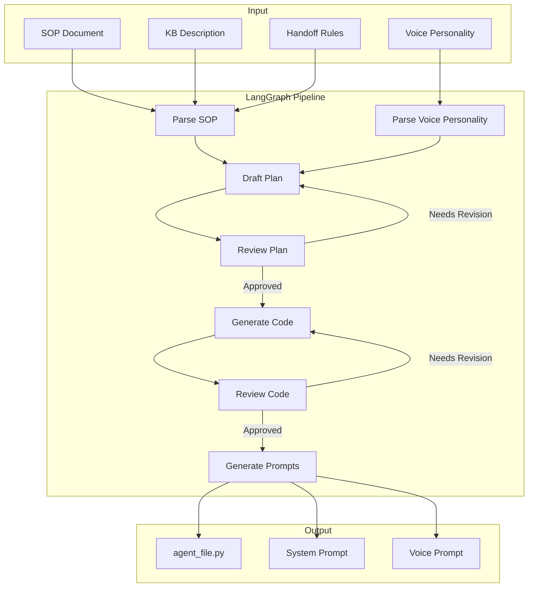
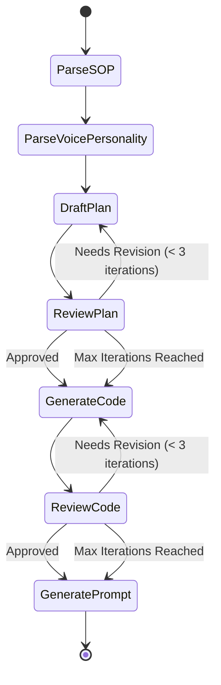
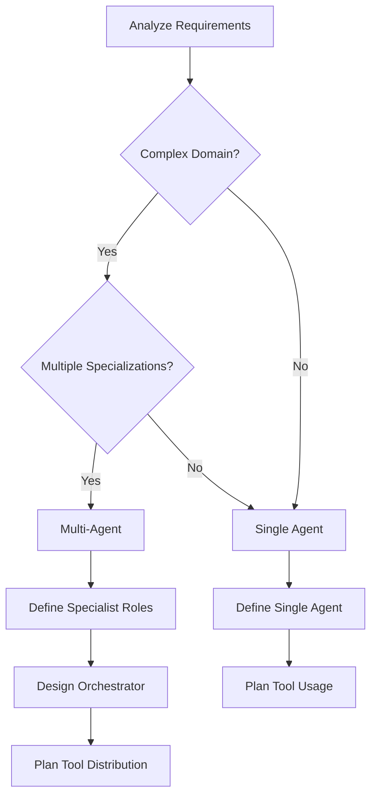
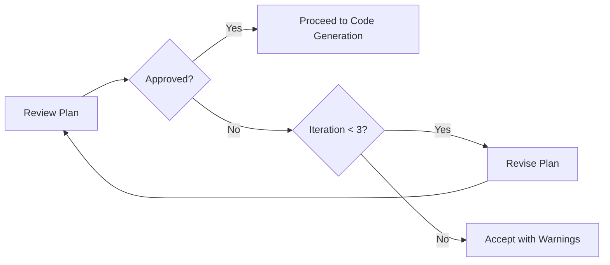
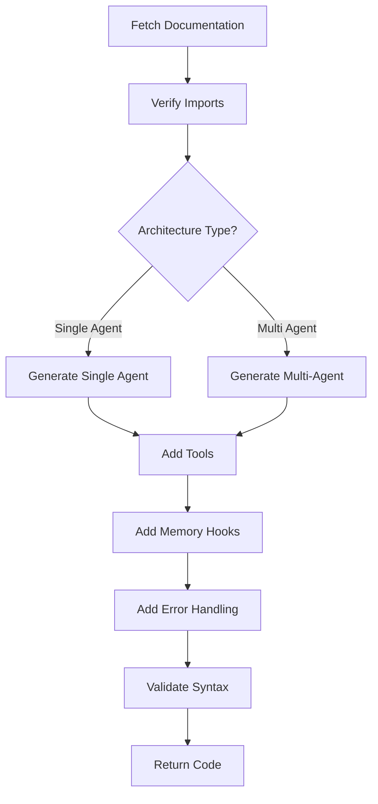
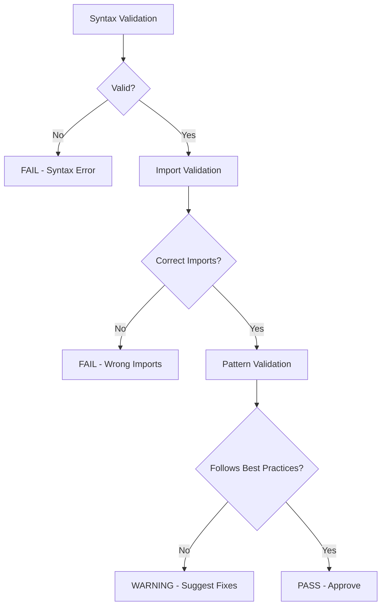
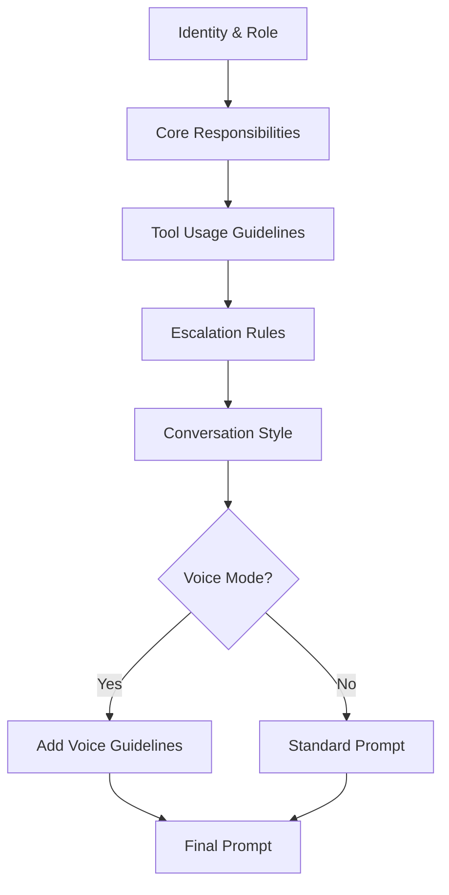
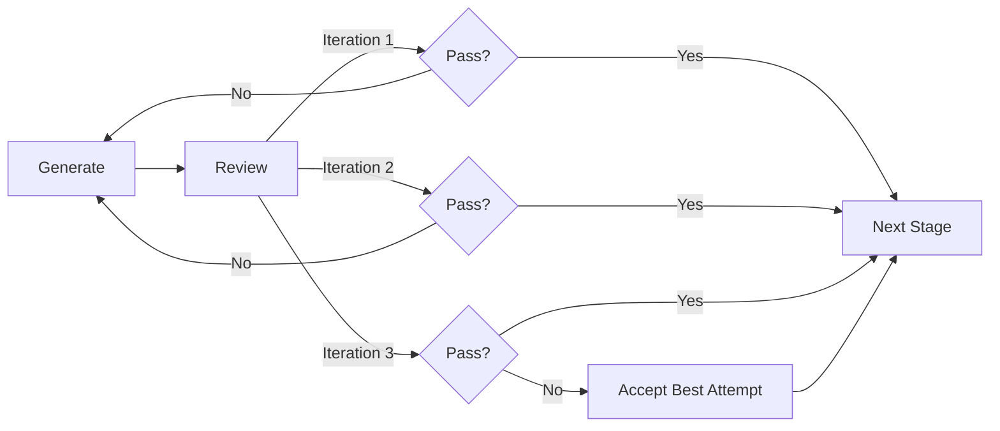
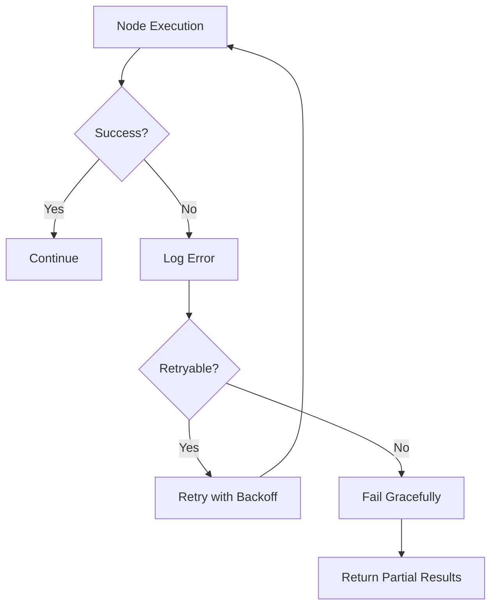

# 🤖 AgentCreator Meta-Agent

The intelligent system that automatically designs, codes, and deploys custom AI agents from SOPs.

---

## Overview

**AgentCreator** is a meta-agent that generates production-ready Strands agents without human coding. It combines:

- **DSPy Framework** - Optimized LLM prompting and reasoning
- **LangGraph** - State machine orchestration with quality gates
- **Bedrock Nova Pro** - Fast, cost-effective LLM
- **MCP Tools** - Access to Strands and AgentCore documentation

**Input:** SOP + Knowledge Base Description + Human Handoff Rules  
**Output:** Production-ready Python code deployed to S3

---

## Architecture Overview



---

## LangGraph State Machine

### **State Definition**

The pipeline maintains state across all nodes:

```python
class AgentCreatorState(TypedDict):
    # Input
    sop: str
    knowledge_base_description: str
    human_handoff_description: str
    voice_personality: Optional[str]
    bedrock_knowledge_base_id: str
    agent_id: str
    
    # Intermediate
    requirements: Requirements
    plan: AgentPlan
    plan_review: PlanReview
    plan_review_count: int
    agent_code: str
    code_review: CodeReview
    code_review_count: int
    
    # Output
    final_agent_code: str
    generated_prompt: SystemPrompt
    voice_prompt: str
```

### **Pipeline Flow**



---

## Pipeline Stages

### **Stage 1: Parse SOP**

**Purpose:** Extract structured requirements from natural language SOP

**DSPy Module:** `SOPParser` (ChainOfThought)

**Input:**
- SOP text
- Knowledge base description
- Human handoff description
- Voice personality (optional)

**Output:** `Requirements` object containing:
- `core_goal` - Primary agent objective
- `business_rules` - Operational constraints
- `escalation_triggers` - When to handoff to human
- `knowledge_base_usage` - When to query KB
- `required_tools` - List of needed tools
- `conversation_style` - Tone and approach

**Example:**
```
Input SOP: "You are a customer service agent. Answer questions about products 
using the knowledge base. Escalate complaints and refund requests over $200."

Output Requirements:
{
  "core_goal": "Provide customer service and product information",
  "business_rules": ["Use knowledge base for product info", "Escalate refunds > $200"],
  "escalation_triggers": ["Complaints", "Refund requests over $200"],
  "knowledge_base_usage": "Query for product information and FAQs",
  "required_tools": ["retrieve", "handoff_to_user"],
  "conversation_style": "Professional and helpful"
}
```

---

### **Stage 2: Parse Voice Personality**

**Purpose:** Extract voice-specific characteristics for natural conversations

**DSPy Module:** `VoicePersonalityParserModule` (ChainOfThought)

**Input:**
- Voice personality JSON (optional)
- SOP text
- Knowledge base description

**Output:** Structured voice characteristics:
- `identity` - Agent's role
- `demeanor` - Personality traits
- `tone` - Communication style
- `formality_level` - Casual to formal
- `enthusiasm_level` - Energy in responses
- `pacing` - Speech speed guidance
- `filler_words` - Natural speech patterns

**Example:**
```
Input Voice Personality:
{
  "identity": "Friendly customer service representative",
  "demeanor": "empathetic, patient, helpful",
  "tone": "warm and professional"
}

Output: Used to generate voice-optimized system prompt
```

---

### **Stage 3: Draft Plan**

**Purpose:** Design optimal agent architecture (single or multi-agent)

**DSPy Module:** `PlanDrafter` (ChainOfThought with MCP tools)

**Input:**
- Requirements
- Bedrock Knowledge Base ID
- Previous plan review feedback (if revision)

**Output:** `AgentPlan` object containing:
- `architecture_type` - "single_agent" or "multi_agent"
- `agent_roles` - List of specialist agents (if multi-agent)
- `orchestration_strategy` - How agents coordinate
- `required_tools` - Tools each agent needs
- `memory_strategy` - How conversation history is managed
- `implementation_notes` - Technical guidance

**Decision Logic:**



**Example Single-Agent Plan:**
```
Architecture: single_agent
Agent Role: Customer service agent
Tools: [retrieve, handoff_to_user]
Memory: Conversation history via hooks
Implementation: Strands Agent with system prompt
```

**Example Multi-Agent Plan:**
```
Architecture: multi_agent
Agent Roles:
  - product_inquiry_agent: Handles product questions
  - order_tracking_agent: Tracks orders
  - returns_agent: Processes returns
Orchestrator: Routes queries to specialists
Tools Distribution:
  - All agents: retrieve (KB access)
  - Orchestrator: handoff_to_user
Memory: Shared across all agents via orchestrator
Implementation: Agents-as-tools pattern
```

**MCP Tool Usage:**
The planner uses MCP tools to access Strands documentation:
- `search_docs` - Find relevant patterns (e.g., "agents-as-tools")
- `fetch_doc` - Get full documentation for implementation details

---

### **Stage 4: Review Plan**

**Purpose:** Validate architecture and suggest improvements

**DSPy Module:** `PlanReviewer` (ChainOfThought)

**Input:**
- Draft plan
- Requirements
- Review iteration count

**Output:** `PlanReview` object containing:
- `approved` - Boolean approval status
- `feedback` - Specific improvement suggestions
- `architecture_concerns` - Issues with design
- `tool_recommendations` - Missing or unnecessary tools
- `memory_concerns` - Memory strategy issues

**Quality Gates:**
1. ✅ Architecture matches requirements complexity
2. ✅ All required tools are included
3. ✅ Memory strategy is appropriate
4. ✅ Escalation paths are clear
5. ✅ Implementation is feasible

**Iteration Logic:**


**Example Review Feedback:**
```
Approved: False
Feedback: "The plan uses a single agent for a complex multi-domain SOP. 
Consider splitting into specialist agents for better maintainability."
Architecture Concerns: "Single agent may struggle with context switching 
between product inquiries and order tracking."
Tool Recommendations: "Add separate agents for each domain."
```

---

### **Stage 5: Generate Code**

**Purpose:** Write production-ready Strands agent code

**DSPy Module:** `CodeGenerator` (ChainOfThought with MCP tools)

**Input:**
- Approved plan
- Requirements
- Bedrock Knowledge Base ID
- Code review feedback (if revision)

**Output:** `CodeGenerationOutput` object containing:
- `agent_code` - Complete Python code
- `imports_used` - List of imports
- `tools_implemented` - Tools included
- `validation_status` - Syntax check result
- `documentation_references` - MCP docs used

**Code Generation Process:**



**Critical Rules:**
1. **MUST fetch documentation first** - Use MCP tools to get correct imports
2. **NO Agent.handle() or Agent.invoke()** - Use callable pattern: `agent(query)`
3. **Correct imports:**
   - `from strands import Agent, tool`
   - `from strands_tools import retrieve, handoff_to_user`
4. **Memory hooks injected by Chameleon** - Accept `hooks` and `state` parameters
5. **Environment variables for KB:** `os.environ["KNOWLEDGE_BASE_ID"]`

**Generated Code Structure (Single Agent):**
```
1. Imports (strands, strands_tools, logging, os)
2. Environment setup (KNOWLEDGE_BASE_ID, logging)
3. create_agent() function - Accepts hooks and state
4. invoke() function - Entrypoint with hooks and state
5. Error handling and logging
```

**Generated Code Structure (Multi-Agent):**
```
1. Imports (strands, strands_tools, logging, os)
2. Environment setup
3. Specialist agent functions (@tool decorated)
4. create_orchestrator() function - Accepts hooks and state
5. invoke() function - Entrypoint with hooks and state
6. Error handling and logging
```

**MCP Tool Usage:**
- `search_docs("community-tools-package")` - Get correct tool imports
- `search_docs("agents-as-tools")` - Get multi-agent pattern
- `fetch_doc(url)` - Get full implementation details

---

### **Stage 6: Review Code**

**Purpose:** Validate code quality, syntax, and best practices

**DSPy Module:** `CodeReviewer` (ChainOfThought)

**Input:**
- Generated code
- Plan
- Requirements

**Output:** `CodeReview` object containing:
- `code_quality_score` - 1-10 rating
- `critical_issues` - Must-fix problems
- `warnings` - Non-critical concerns
- `suggestions` - Improvement ideas
- `syntax_valid` - Boolean syntax check
- `imports_correct` - Import validation
- `multi_agent_compliance` - Pattern adherence (if applicable)

**Validation Checks:**



**Quality Criteria:**
1. ✅ Syntax is valid Python
2. ✅ Imports match documentation
3. ✅ Agent is callable (not using .invoke())
4. ✅ Memory hooks accepted as parameters
5. ✅ Error handling present
6. ✅ Logging configured
7. ✅ Environment variables used correctly
8. ✅ Tools properly integrated

**Iteration Logic:**
- **Critical issues** → Force revision (if iterations < 3)
- **Warnings only** → Approve with notes
- **Max iterations reached** → Accept best attempt

**Example Review:**
```
Code Quality Score: 8/10
Critical Issues: []
Warnings: ["Consider adding more detailed error messages"]
Suggestions: ["Add type hints for better IDE support"]
Syntax Valid: True
Imports Correct: True
Multi-Agent Compliance: "Correctly implements agents-as-tools pattern"
```

---

### **Stage 7: Generate Prompts**

**Purpose:** Create optimized system prompts for text and voice

**DSPy Module:** `PromptGenerator` (ChainOfThought)

**Input:**
- Requirements
- Plan
- Voice personality (optional)

**Output:** `SystemPrompt` object containing:
- `full_prompt` - Complete system prompt for text agents
- `voice_optimized_prompt` - Concise prompt for voice agents
- `personality_traits` - Key characteristics
- `conversation_guidelines` - Interaction rules

**Prompt Structure:**



**Text Prompt Example:**
```
You are a customer service agent for Acme Corp.

RESPONSIBILITIES:
- Answer product questions using the knowledge base
- Track order status
- Process returns under $200

TOOLS:
- retrieve: Search knowledge base for product information
- handoff_to_user: Escalate to human for complaints or refunds over $200

ESCALATION TRIGGERS:
- Customer complaints
- Refund requests over $200
- Technical issues you cannot resolve

CONVERSATION STYLE:
- Professional and helpful
- Empathetic to customer concerns
- Clear and concise responses
```

**Voice Prompt Example:**
```
You are a friendly customer service agent.

Keep responses brief (1-2 sentences). Use natural, conversational language.

TOOLS:
- retrieve: Look up product info
- handoff_to_user: Transfer to human agent

ESCALATION:
- Complaints or refunds over $200

VOICE GUIDELINES:
- Speak naturally, avoid jargon
- Confirm actions verbally
- Ask one question at a time
```

---

## Technology Deep Dive

### **DSPy Framework**

**What is DSPy?**
DSPy is a framework for programming LLMs using composable modules instead of manual prompting.

**Key Concepts:**
- **Signatures** - Define input/output contracts
- **Modules** - Reusable LLM components (ChainOfThought, ReAct)
- **Compilation** - Automatic prompt optimization

**Example Signature:**
```python
class SOPParserSignature(dspy.Signature):
    """Extract structured requirements from SOP"""
    sop_text = dspy.InputField(desc="Standard Operating Procedure")
    requirements = dspy.OutputField(desc="Structured requirements in JSON")
```

**Example Module:**
```python
class SOPParser(dspy.Module):
    def __init__(self):
        super().__init__()
        self.parser = dspy.ChainOfThought(SOPParserSignature)
    
    async def aforward(self, sop: str) -> Requirements:
        result = await self.parser(sop_text=sop)
        return Requirements(**json.loads(result.requirements))
```

**Benefits:**
- Consistent prompting across pipeline
- Automatic optimization
- Type-safe inputs/outputs
- Easy to test and iterate

---

### **LangGraph Orchestration**

**What is LangGraph?**
LangGraph is a state machine framework for building multi-step LLM workflows.

**Key Concepts:**
- **StateGraph** - Defines workflow structure
- **Nodes** - Individual processing steps
- **Edges** - Transitions between nodes
- **Conditional Edges** - Dynamic routing based on state

**Pipeline Definition:**
```python
workflow = StateGraph(AgentCreatorState)

# Add nodes
workflow.add_node("parse_sop", parse_sop_node)
workflow.add_node("draft_plan", draft_plan_node)
workflow.add_node("review_plan", review_plan_node)
workflow.add_node("generate_code", generate_code_node)
workflow.add_node("review_code", review_code_node)
workflow.add_node("generate_prompt", generate_prompt_node)

# Add edges
workflow.set_entry_point("parse_sop")
workflow.add_edge("parse_sop", "draft_plan")
workflow.add_edge("draft_plan", "review_plan")

# Conditional edge for plan review
workflow.add_conditional_edges(
    "review_plan",
    should_continue_review,
    {
        "continue": "draft_plan",  # Needs revision
        "approve": "generate_code"  # Approved
    }
)
```

**Benefits:**
- Clear workflow visualization
- Easy to add quality gates
- Supports cycles (iterative refinement)
- State persistence across nodes

---

### **MCP Tools Integration**

**What is MCP?**
Model Context Protocol - A standard for providing context to LLMs.

**Available MCP Servers:**
- **Strands Agents** - Documentation for Strands SDK
- **AWS AgentCore** - Documentation for AgentCore platform
- **AWS Docs** - General AWS documentation

**Tool Usage in Pipeline:**
```python
# Search for relevant documentation
results = await search_docs(query="agents-as-tools pattern")

# Fetch full documentation
doc_content = await fetch_doc(uri=results[0]['url'])

# Use in code generation
code = generate_code_with_docs(plan, doc_content)
```

**Benefits:**
- Always uses latest documentation
- Reduces hallucination
- Ensures correct imports and patterns
- Self-updating as docs change

---

## Quality Assurance

### **Iterative Refinement**

Each stage with a review step allows up to 3 iterations:



**Why 3 Iterations?**
- Balance between quality and speed
- Prevents infinite loops
- Most issues resolved in 1-2 iterations
- Diminishing returns after 3 attempts

### **Validation Tools**

**Syntax Validation:**
- Python AST parsing
- Import verification
- Function signature checks

**Pattern Validation:**
- Strands SDK compliance
- Memory hook integration
- Tool usage correctness

**Documentation Validation:**
- MCP tool references
- Import statement verification
- API usage correctness

---

## Performance Metrics

**Typical Pipeline Execution:**
- **Parse SOP:** 3-5 seconds
- **Draft Plan:** 5-8 seconds
- **Review Plan:** 3-5 seconds (per iteration)
- **Generate Code:** 10-15 seconds
- **Review Code:** 5-8 seconds (per iteration)
- **Generate Prompts:** 3-5 seconds

**Total Time:** 30-60 seconds (depending on iterations)

**Cost per Agent:**
- **Nova Pro tokens:** ~5,000-10,000 tokens
- **Cost:** ~$0.05-$0.10 per agent creation

---

## Error Handling

### **Pipeline Failures**



**Failure Scenarios:**
1. **LLM Timeout** - Retry with exponential backoff
2. **Invalid JSON** - Parse with error recovery
3. **MCP Tool Failure** - Continue without docs (with warning)
4. **Syntax Error** - Force code review iteration
5. **Max Iterations** - Accept best attempt with warnings

### **Graceful Degradation**

If pipeline fails at any stage:
1. Log detailed error information
2. Save partial state to DynamoDB
3. Return error to Step Functions
4. Allow manual intervention or retry

---

## Future Enhancements

- [ ] **OpenAPI Integration** - Generate tools from API specs
- [ ] **Multi-language Support** - Generate agents in TypeScript, Go
- [ ] **A/B Testing** - Generate multiple agent variants
- [ ] **Performance Optimization** - Parallel node execution
- [ ] **Custom Tool Generation** - Create tools from descriptions
- [ ] **Agent Versioning** - Track and rollback agent versions
- [ ] **Automated Testing** - Generate test cases for agents

---

## Related Documentation

- [Main README](../README.md) - Project overview
- [Voice Agents](VOICE_AGENTS.md) - Voice integration
- [Deployment](DEPLOYMENT.md) - Infrastructure setup
- [Architecture](ORATIO_ARCHITECTURE.md) - System design

---

**Built with DSPy, LangGraph, and AWS Bedrock**
