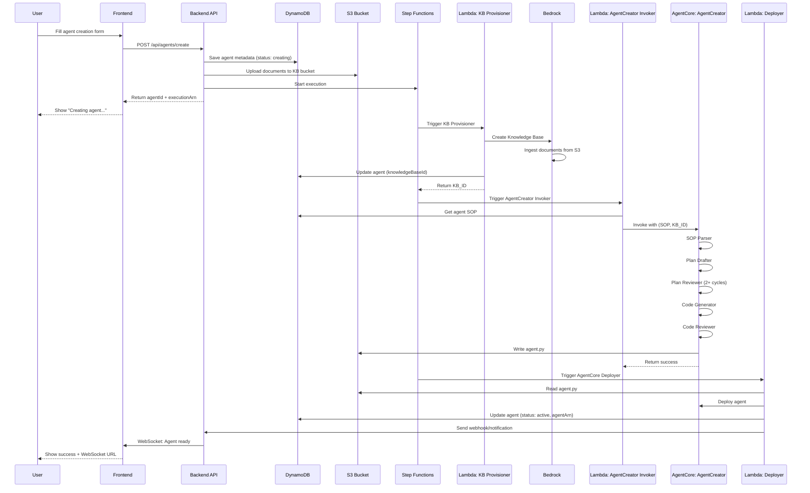

# Oratio - Voice & Conversational Agent Platform
## Architecture & Implementation Plan

**Hackathon Project for AWS**  
**Timeline: 2 weeks**  
**Goal: Win by showcasing innovative meta-agent architecture**

---

## 🎯 Executive Summary

Oratio is a multi-tenant SaaS platform that enables developers and enterprises to create, deploy, and manage voice and conversational AI agents **without writing code**. The platform uses a **meta-agent architecture** where an AgentCreator agent (deployed on AWS AgentCore) automatically designs, implements, reviews, and deploys custom agents based on user requirements.

**User provides:**
1. **SOP (Standard Operating Procedure)** - Agent's behavior and guidelines
2. **Knowledge Base** - Documents (PDF, Markdown) for context
3. **Configuration** - Voice/text preferences, human handoff rules

**Platform automatically generates:**
- **Custom AgentCore agent** - Architecturally designed and code-generated
- **WebSocket endpoint** for real-time voice interactions (Nova Sonic)
- **REST API** for text conversations (Claude via Bedrock)
- **API keys** for authentication
- **Live monitoring dashboard** for ongoing sessions
- **Human handoff notifications** when conditions are met

---

## 🏗️ System Architecture Overview

### Three-Tier Architecture

```
┌─────────────────────────────────────────────────────────────────┐
│                    PRESENTATION TIER                             │
│                                                                   │
│  ┌────────────────────────────────────────────────────────┐    │
│  │         Next.js 14 Frontend (TypeScript)               │    │
│  │         - User authentication                          │    │
│  │         - Agent creation wizard                        │    │
│  │         - Live session monitoring                      │    │
│  │         - Notification center                          │    │
│  │         - API key management                           │    │
│  └────────────────────────────────────────────────────────┘    │
│                           │                                      │
│                           │ HTTPS REST API                       │
│                           │ WebSocket (for live updates)         │
└───────────────────────────┼──────────────────────────────────────┘
                            │
┌───────────────────────────┼──────────────────────────────────────┐
│                    APPLICATION TIER                              │
│                           ▼                                      │
│  ┌────────────────────────────────────────────────────────┐    │
│  │         FastAPI Backend (Python)                       │    │
│  │         - REST API endpoints                           │    │
│  │         - Authentication & authorization               │    │
│  │         - Business logic                               │    │
│  │         - AWS service orchestration                    │    │
│  │         - WebSocket server (live updates)              │    │
│  └────────────────────────────────────────────────────────┘    │
│                           │                                      │
│                           │ Boto3 SDK                            │
│                           │                                      │
└───────────────────────────┼──────────────────────────────────────┘
                            │
┌───────────────────────────┼──────────────────────────────────────┐
│                      DATA & SERVICE TIER                         │
│                           ▼                                      │
│  ┌─────────────┐  ┌─────────────┐  ┌────────────────────┐     │
│  │  DynamoDB   │  │     S3      │  │  Step Functions    │     │
│  │  (State)    │  │  (Storage)  │  │  (Orchestration)   │     │
│  └─────────────┘  └─────────────┘  └────────────────────┘     │
│                                                                  │
│  ┌─────────────┐  ┌─────────────┐  ┌────────────────────┐     │
│  │  Lambda     │  │  Bedrock    │  │   AgentCore        │     │
│  │  Functions  │  │  (AI/ML)    │  │   (Agents)         │     │
│  └─────────────┘  └─────────────┘  └────────────────────┘     │
│                                                                  │
│  ┌─────────────┐  ┌─────────────┐  ┌────────────────────┐     │
│  │  SNS/SES    │  │ CloudWatch  │  │   AWS Amplify      │     │
│  │  (Notify)   │  │ (Monitoring)│  │   (Frontend Host)  │     │
│  └─────────────┘  └─────────────┘  └────────────────────┘     │
└──────────────────────────────────────────────────────────────────┘
```

**Frontend Hosting**: Both the admin dashboard and client demo app are deployed on **AWS Amplify** for seamless CI/CD and global CDN distribution.

### Detailed Architecture Diagram

```
┌────────────────────────────────────────────────────────────────────┐
│                         FRONTEND LAYER                              │
├────────────────────────────────────────────────────────────────────┤
│                                                                      │
│  ┌──────────────────────────────────────────────────────────────┐ │
│  │  Next.js 14 Application (app/)                               │ │
│  │                                                               │ │
│  │  Pages:                                                       │ │
│  │  ├─ /login, /register          (Authentication)             │ │
│  │  ├─ /dashboard                 (Overview)                    │ │
│  │  ├─ /agents                    (Agent list)                  │ │
│  │  ├─ /agents/new                (Create wizard)               │ │
│  │  ├─ /agents/[id]               (Agent details)               │ │
│  │  ├─ /sessions/live             (Live monitoring)             │ │
│  │  ├─ /sessions/[id]             (Session details)             │ │
│  │  ├─ /notifications             (Notification center)         │ │
│  │  └─ /api-keys                  (Key management)              │ │
│  │                                                               │ │
│  │  API Client (lib/api.ts):                                    │ │
│  │  └─ All backend communication via fetch/axios                │ │
│  └──────────────────────────────────────────────────────────────┘ │
│                                                                      │
└──────────────────────────┬───────────────────────────────────────────┘
                           │
                           │ HTTPS/WSS
                           │
┌──────────────────────────┼───────────────────────────────────────────┐
│                   BACKEND API LAYER                                  │
├──────────────────────────┴───────────────────────────────────────────┤
│                                                                        │
│  ┌──────────────────────────────────────────────────────────────┐   │
│  │  FastAPI Application                                         │   │
│  │                                                               │   │
│  │  Routers:                                                     │   │
│  │  ├─ /api/auth              (Login, register, JWT)           │   │
│  │  ├─ /api/agents            (CRUD operations)                 │   │
│  │  ├─ /api/agents/create     (Trigger creation)                │   │
│  │  ├─ /api/documents         (Upload handler)                  │   │
│  │  ├─ /api/sessions          (Query sessions)                  │   │
│  │  ├─ /api/sessions/live     (Active sessions)                 │   │
│  │  ├─ /api/notifications     (Get/mark notifications)          │   │
│  │  ├─ /api/api-keys          (Generate, list, revoke)          │   │
│  │  └─ /ws/dashboard          (WebSocket for live updates)      │   │
│  │                                                               │   │
│  │  AWS Service Clients (Boto3):                                │   │
│  │  ├─ DynamoDB (get/put/query)                                 │   │
│  │  ├─ S3 (upload/download)                                     │   │
│  │  ├─ Step Functions (start execution)                         │   │
│  │  ├─ SNS/SES (send notifications)                             │   │
│  │  └─ CloudWatch (logging)                                     │   │
│  │                                                               │   │
│  │  Services:                                                    │   │
│  │  ├─ AuthService (JWT, password hashing)                      │   │
│  │  ├─ AgentService (agent operations)                          │   │
│  │  ├─ SessionService (session tracking)                        │   │
│  │  ├─ NotificationService (alerts)                             │   │
│  │  └─ ApiKeyService (key management)                           │   │
│  └──────────────────────────────────────────────────────────────┘   │
│                                                                       │
└───────────────────────────┬───────────────────────────────────────────┘
                            │
                            │ Boto3 SDK
                            │
┌───────────────────────────┼───────────────────────────────────────────┐
│                   AWS SERVICES LAYER                                  │
├───────────────────────────┴───────────────────────────────────────────┤
│                                                                        │
│  ┌─────────────────────────────────────────────────────────────┐    │
│  │  DynamoDB Tables                                            │    │
│  │  ├─ oratio-users                                            │    │
│  │  ├─ oratio-agents                                           │    │
│  │  ├─ oratio-api-keys                                         │    │
│  │  ├─ oratio-sessions                                         │    │
│  │  └─ oratio-notifications                                    │    │
│  └─────────────────────────────────────────────────────────────┘    │
│                                                                        │
│  ┌─────────────────────────────────────────────────────────────┐    │
│  │  S3 Buckets                                                 │    │
│  │  ├─ oratio-knowledge-bases/{userId}/{agentId}/*.pdf         │    │
│  │  ├─ oratio-generated-code/{agentId}/agent.py                │    │
│  │  └─ oratio-recordings/{sessionId}/audio.wav                 │    │
│  └─────────────────────────────────────────────────────────────┘    │
│                                                                        │
│  ┌─────────────────────────────────────────────────────────────┐    │
│  │  Step Functions: AgentCreationWorkflow                      │    │
│  │                                                              │    │
│  │  State 1: Lambda - KBProvisioner                            │    │
│  │     └─► Create Bedrock KB + Start ingestion                │    │
│  │                                                              │    │
│  │  State 2: Lambda - AgentCreatorInvoker                      │    │
│  │     └─► Invoke AgentCreator meta-agent                      │    │
│  │                                                              │    │
│  │  State 3: Wait + Check for S3 code                          │    │
│  │                                                              │    │
│  │  State 4: Lambda - AgentCoreDeployer                        │    │
│  │     └─► Deploy agent to AgentCore                           │    │
│  └─────────────────────────────────────────────────────────────┘    │
│                                                                        │
│  ┌─────────────────────────────────────────────────────────────┐    │
│  │  Lambda Functions                                           │    │
│  │  ├─ KBProvisioner (creates Bedrock KB)                      │    │
│  │  ├─ AgentCreatorInvoker (calls meta-agent)                  │    │
│  │  ├─ CheckS3Code (polls for generated code)                  │    │
│  │  ├─ AgentCoreDeployer (deploys to AgentCore)                │    │
│  │  └─ NotificationHandler (sends emails)                      │    │
│  └─────────────────────────────────────────────────────────────┘    │
│                                                                        │
│  ┌─────────────────────────────────────────────────────────────┐    │
│  │  AWS Bedrock                                                │    │
│  │  ├─ Nova Sonic (voice interactions)                         │    │
│  │  ├─ Claude (text conversations)                             │    │
│  │  └─ Knowledge Bases (RAG)                                   │    │
│  └─────────────────────────────────────────────────────────────┘    │
│                                                                        │
│  ┌─────────────────────────────────────────────────────────────┐    │
│  │  AWS AgentCore                                              │    │
│  │  ├─ AgentCreator (meta-agent, pre-deployed)                 │    │
│  │  └─ Customer Agents (dynamically deployed)                  │    │
│  └─────────────────────────────────────────────────────────────┘    │
│                                                                        │
└────────────────────────────────────────────────────────────────────────┘

┌────────────────────────────────────────────────────────────────────────┐
│                   VOICE/TEXT RUNTIME SERVICES                          │
│                   (Separate from main backend)                         │
├────────────────────────────────────────────────────────────────────────┤
│                                                                          │
│  ┌──────────────────────────────────────────────────────────────┐     │
│  │  Voice Service (FastAPI WebSocket)                           │     │
│  │  Endpoint: wss://voice.oratio.io/ws/{agentId}                │     │
│  │                                                               │     │
│  │  ├─ Authenticate via API key                                 │     │
│  │  ├─ Create session in DynamoDB                               │     │
│  │  ├─ Initialize Nova Sonic (from sonic.py)                    │     │
│  │  ├─ Bidirectional audio streaming                            │     │
│  │  ├─ Invoke AgentCore agent for responses                     │     │
│  │  ├─ Detect handoff conditions                                │     │
│  │  └─ Save transcript + audio to S3                            │     │
│  └──────────────────────────────────────────────────────────────┘     │
│                                                                          │
│  ┌──────────────────────────────────────────────────────────────┐     │
│  │  Text Service (FastAPI REST)                                 │     │
│  │  Endpoint: https://api.oratio.io/chat/{agentId}              │     │
│  │                                                               │     │
│  │  ├─ Authenticate via API key                                 │     │
│  │  ├─ Get/create session                                       │     │
│  │  ├─ Invoke AgentCore agent                                   │     │
│  │  ├─ Detect handoff conditions                                │     │
│  │  ├─ Update session in DynamoDB                               │     │
│  │  └─ Return response with sources                             │     │
│  └──────────────────────────────────────────────────────────────┘     │
│                                                                          │
└──────────────────────────────────────────────────────────────────────────┘
```

---

## 🔄 Detailed Workflows

### Workflow 1: User Registration & Login

```
User → Frontend → Backend API → DynamoDB

1. User fills registration form
2. Frontend: POST /api/auth/register
   {
     email, password, name, organizationName
   }
3. Backend:
   - Hash password (bcrypt)
   - Generate userId (UUID)
   - Store in DynamoDB (oratio-users)
   - Return JWT token
4. Frontend: Store JWT in localStorage/cookies
5. Subsequent requests include: Authorization: Bearer {JWT}
```

### Workflow 2: Agent Creation (Complete Flow)



**Detailed Steps:**

1. **Frontend - Agent Creation Form**:
```typescript
// frontend/app/(dashboard)/agents/new/page.tsx
async function handleSubmit(formData: AgentFormData) {
  try {
    // Step 1: Call backend API (NOT direct S3/DynamoDB)
    const response = await fetch('/api/agents/create', {
      method: 'POST',
      headers: {
        'Authorization': `Bearer ${getToken()}`,
        'Content-Type': 'application/json'
      },
      body: JSON.stringify({
        name: formData.name,
        sop: formData.sop,
        agentType: formData.agentType, // voice, text, or both
        voiceConfig: formData.voiceConfig,
        textConfig: formData.textConfig,
        humanHandoffEnabled: formData.humanHandoffEnabled,
        humanHandoffConditions: formData.humanHandoffConditions,
        documents: formData.documents.map(d => ({
          name: d.name,
          size: d.size,
          type: d.type,
          content: d.base64Content // or multipart upload
        }))
      })
    });
    
    const data = await response.json();
    
    // Step 2: Show progress (backend handles everything)
    setAgentId(data.agentId);
    setStatus('creating');
    
    // Step 3: Poll for updates or listen to WebSocket
    pollAgentStatus(data.agentId);
    
  } catch (error) {
    showError(error.message);
  }
}

// Poll for agent creation status
async function pollAgentStatus(agentId: string) {
  const interval = setInterval(async () => {
    const response = await fetch(`/api/agents/${agentId}`, {
      headers: { 'Authorization': `Bearer ${getToken()}` }
    });
    const agent = await response.json();
    
    if (agent.status === 'active') {
      clearInterval(interval);
      showSuccess(agent);
    } else if (agent.status === 'failed') {
      clearInterval(interval);
      showError('Agent creation failed');
    }
  }, 3000); // Poll every 3 seconds
}
```

2. **Backend API - Agent Creation Endpoint**:
```python
# backend/api/routers/agents.py
from fastapi import APIRouter, Depends, HTTPException, UploadFile, File
from typing import List
import boto3
import uuid
from datetime import datetime

router = APIRouter()
dynamodb = boto3.resource('dynamodb')
s3 = boto3.client('s3')
sfn = boto3.client('stepfunctions')

@router.post("/agents/create")
async def create_agent(
    request: AgentCreateRequest,
    current_user: User = Depends(get_current_user)
):
    """
    Handles agent creation:
    1. Validates input
    2. Saves metadata to DynamoDB
    3. Uploads documents to S3
    4. Triggers Step Functions
    """
    
    # Generate unique agent ID
    agent_id = str(uuid.uuid4())
    user_id = current_user.user_id
    
    try:
        # Step 1: Save agent metadata to DynamoDB
        agents_table = dynamodb.Table('oratio-agents')
        agents_table.put_item(
            Item={
                'userId': user_id,
                'agentId': agent_id,
                'agentName': request.name,
                'agentType': request.agentType,
                'sop': request.sop,
                'voiceConfig': request.voiceConfig,
                'textConfig': request.textConfig,
                'humanHandoffEnabled': request.humanHandoffEnabled,
                'humanHandoffConditions': request.humanHandoffConditions,
                'status': 'creating',
                'createdAt': int(datetime.utcnow().timestamp()),
                'updatedAt': int(datetime.utcnow().timestamp())
            }
        )
        
        # Step 2: Upload documents to S3
        kb_bucket = os.environ['KB_BUCKET_NAME']
        for doc in request.documents:
            s3_key = f"{user_id}/{agent_id}/{doc.name}"
            
            # Decode base64 if needed
            content = base64.b64decode(doc.content) if doc.content else b''
            
            s3.put_object(
                Bucket=kb_bucket,
                Key=s3_key,
                Body=content,
                ContentType=doc.type,
                Metadata={
                    'userId': user_id,
                    'agentId': agent_id
                }
            )
        
        # Step 3: Trigger Step Functions workflow
        sfn_response = sfn.start_execution(
            stateMachineArn=os.environ['AGENT_CREATION_STATE_MACHINE_ARN'],
            name=f"create-agent-{agent_id}",
            input=json.dumps({
                'userId': user_id,
                'agentId': agent_id,
                'kbBucket': kb_bucket,
                'kbPrefix': f"{user_id}/{agent_id}/"
            })
        )
        
        return {
            'agentId': agent_id,
            'executionArn': sfn_response['executionArn'],
            'message': 'Agent creation started',
            'status': 'creating'
        }
        
    except Exception as e:
        # Cleanup on error
        logger.error(f"Error creating agent: {e}")
        
        # Update status to failed
        agents_table.update_item(
            Key={'userId': user_id, 'agentId': agent_id},
            UpdateExpression='SET #status = :status',
            ExpressionAttributeNames={'#status': 'status'},
            ExpressionAttributeValues={':status': 'failed'}
        )
        
        raise HTTPException(status_code=500, detail=str(e))


@router.get("/agents/{agent_id}")
async def get_agent(
    agent_id: str,
    current_user: User = Depends(get_current_user)
):
    """Get agent details"""
    agents_table = dynamodb.Table('oratio-agents')
    
    response = agents_table.get_item(
        Key={
            'userId': current_user.user_id,
            'agentId': agent_id
        }
    )
    
    if 'Item' not in response:
        raise HTTPException(status_code=404, detail="Agent not found")
    
    return response['Item']


@router.get("/agents")
async def list_agents(current_user: User = Depends(get_current_user)):
    """List all agents for current user"""
    agents_table = dynamodb.Table('oratio-agents')
    
    response = agents_table.query(
        KeyConditionExpression='userId = :userId',
        ExpressionAttributeValues={
            ':userId': current_user.user_id
        }
    )
    
    return response['Items']
```

3. **Step Functions Workflow** (orchestrates the pipeline)

4. **Lambda Functions** (KB Provisioner, AgentCreator Invoker, Deployer)

5. **AgentCreator Meta-Agent** (the sophisticated multi-module pipeline)

### Workflow 3: Voice Interaction

```
Customer App → Voice Service (WebSocket) → Nova Sonic → AgentCore Agent

1. Customer connects: wss://voice.oratio.io/ws/{agentId}?api_key={key}
2. Voice Service:
   - Validates API key (query DynamoDB)
   - Creates session record (write to DynamoDB)
   - Initializes Nova Sonic (from sonic.py)
   - Starts bidirectional streaming
3. Audio loop:
   - Receive audio from customer → Nova Sonic
   - Nova Sonic → Invoke AgentCore agent for decisions
   - AgentCore agent → Returns response
   - Response audio → Send to customer
4. On disconnect:
   - Save transcript (update DynamoDB)
   - Upload audio recording (S3)
   - Update session status
```

### Workflow 4: Text Conversation

```
Customer App → Backend API → AgentCore Agent → Backend API → Customer

POST https://api.oratio.io/chat/{agentId}
Headers: Authorization: Bearer {api_key}
Body: { "message": "Hello", "sessionId": "optional" }

1. Backend:
   - Validates API key
   - Gets/creates session
   - Retrieves agent config
   - Invokes AgentCore agent
   - Checks for handoff triggers
   - Updates session
   - Returns response
```

### Workflow 5: Live Session Monitoring

```
User → Frontend → Backend API (WebSocket) → DynamoDB

1. User opens live sessions page
2. Frontend: Connects to ws://api.oratio.io/ws/dashboard
3. Backend WebSocket:
   - Authenticates user (JWT)
   - Queries active sessions from DynamoDB
   - Sends initial data
   - Subscribes to updates
4. When sessions change:
   - Backend pushes updates via WebSocket
   - Frontend updates UI in real-time
```

### Workflow 6: Human Handoff

```
Trigger detected → Backend → DynamoDB + SNS/SES → Frontend

1. Handoff condition detected (voice or text service)
2. Create notification record (DynamoDB)
3. Update session status → handoff_requested
4. Send notification:
   - In-app: Push via WebSocket to connected dashboard users
   - Email: Send via SES to user
5. Frontend shows alert with session details
```

---

## 📊 Database Schema (DynamoDB)

### Table 1: `oratio-users`
```
PK: userId (String) - UUID
SK: userId (String) - Same as PK

Attributes:
- email (String)
- passwordHash (String)
- name (String)
- organizationName (String)
- createdAt (Number)
- lastLogin (Number)
- subscriptionTier (String)
```

### Table 2: `oratio-agents`
```
PK: userId (String)
SK: agentId (String) - UUID

Attributes:
- agentName (String)
- agentType (String) - voice|text|both
- sop (String)
- voiceConfig (Map)
- textConfig (Map)
- knowledgeBaseId (String)
- knowledgeBaseArn (String)
- agentCoreAgentId (String)
- agentCoreAgentArn (String)
- humanHandoffEnabled (Boolean)
- humanHandoffConditions (List<String>)
- status (String) - creating|active|failed|paused
- createdAt (Number)
- updatedAt (Number)
- websocketUrl (String)
- apiEndpoint (String)

GSI: agentId-index
```

### Table 3: `oratio-api-keys`
```
PK: apiKeyHash (String)
SK: apiKeyHash (String)

Attributes:
- userId (String)
- agentId (String)
- keyName (String)
- createdAt (Number)
- expiresAt (Number)
- lastUsedAt (Number)
- usageCount (Number)
- isActive (Boolean)

GSI: userId-agentId-index
```

### Table 4: `oratio-sessions`
```
PK: sessionId (String) - UUID
SK: timestamp (Number)

Attributes:
- agentId (String)
- userId (String)
- sessionType (String) - voice|text
- status (String) - active|completed|handoff_requested|error
- startTime (Number)
- endTime (Number)
- duration (Number)
- messageCount (Number)
- transcript (List<Map>)
- audioRecordingUrl (String)
- handoffRequested (Boolean)
- handoffReason (String)
- customerMetadata (Map)

GSI: agentId-timestamp-index
GSI: userId-timestamp-index
GSI: status-index
```

### Table 5: `oratio-notifications`
```
PK: notificationId (String) - UUID
SK: timestamp (Number)

Attributes:
- userId (String)
- agentId (String)
- sessionId (String)
- type (String)
- status (String)
- priority (String)
- message (String)
- metadata (Map)
- emailSent (Boolean)
- createdAt (Number)

GSI: userId-status-index
```

---

## 🛠️ Backend API Structure

### Directory Layout

```
backend/
├── main.py                      # FastAPI app entry point
├── config.py                    # Configuration (env vars)
├── dependencies.py              # Shared dependencies
├── models/
│   ├── user.py
│   ├── agent.py
│   ├── session.py
│   ├── notification.py
│   └── api_key.py
├── routers/
│   ├── auth.py                  # /api/auth/*
│   ├── agents.py                # /api/agents/*
│   ├── sessions.py              # /api/sessions/*
│   ├── notifications.py         # /api/notifications/*
│   ├── api_keys.py              # /api/api-keys/*
│   └── websocket.py             # /ws/dashboard
├── services/
│   ├── auth_service.py          # JWT, password hashing
│   ├── agent_service.py         # Agent operations
│   ├── session_service.py       # Session tracking
│   ├── notification_service.py  # Notification management
│   └── api_key_service.py       # API key generation/validation
├── aws/
│   ├── dynamodb_client.py       # DynamoDB operations
│   ├── s3_client.py             # S3 operations
│   ├── stepfunctions_client.py  # Step Functions
│   ├── bedrock_client.py        # Bedrock operations
│   └── ses_client.py            # Email sending
└── utils/
    ├── logging.py
    ├── validators.py
    └── helpers.py
```

### Key API Endpoints

```python
# Authentication
POST   /api/auth/register
POST   /api/auth/login
POST   /api/auth/refresh
GET    /api/auth/me

# Agents
POST   /api/agents/create
GET    /api/agents
GET    /api/agents/{agent_id}
PATCH  /api/agents/{agent_id}
DELETE /api/agents/{agent_id}

# Sessions
GET    /api/sessions
GET    /api/sessions/live
GET    /api/sessions/{session_id}
GET    /api/sessions/{session_id}/transcript

# Notifications
GET    /api/notifications
PATCH  /api/notifications/{notification_id}/read
PATCH  /api/notifications/{notification_id}/acknowledge

# API Keys
POST   /api/api-keys
GET    /api/api-keys
DELETE /api/api-keys/{key_id}

# WebSocket
WS     /ws/dashboard            # Live updates for dashboard
```

---

## ⏱️ Implementation Timeline (2 Weeks)

### Week 1: Core Infrastructure

**Days 1-2: Foundation**
- [ ] Set up project structure (backend + frontend)
- [ ] Configure AWS services (DynamoDB tables, S3 buckets)
- [ ] Implement authentication (JWT, password hashing)
- [ ] Create basic API endpoints (CRUD)

**Days 3-4: AgentCreator Pipeline**
- [ ] Implement AgentCreator meta-agent modules
- [ ] Create Step Functions workflow
- [ ] Build Lambda functions (KB Provisioner, Invoker, Deployer)
- [ ] Test agent creation end-to-end

**Days 5-7: Voice Service**
- [ ] Adapt sonic.py to FastAPI WebSocket
- [ ] Implement API key validation
- [ ] Add session management
- [ ] Test voice interactions

### Week 2: Frontend & Polish

**Days 8-10: Frontend Development**
- [ ] Next.js setup with Tailwind + shadcn/ui
- [ ] Authentication pages (login, register)
- [ ] Agent creation wizard (multi-step form)
- [ ] Dashboard and agent list
- [ ] API key management UI

**Days 11-12: Live Monitoring & Notifications**
- [ ] Live session dashboard with WebSocket
- [ ] Notification system (in-app + email)
- [ ] Human handoff workflow
- [ ] Text conversation service

**Days 13-14: Testing & Demo**
- [ ] End-to-end testing
- [ ] Bug fixes and polish
- [ ] Demo preparation
- [ ] Documentation
- [ ] Presentation slides

---

## 🚨 Key Implementation Notes

### 1. **Separation of Concerns**
- Frontend ONLY communicates with Backend API
- Backend handles ALL AWS service interactions
- Clear API contract between layers

### 2. **Security**
- JWT authentication for frontend
- API key authentication for customer apps
- Hashed API keys in database
- Rate limiting on all endpoints
- Input validation and sanitization

### 3. **Scalability**
- Stateless backend (can scale horizontally)
- DynamoDB for automatic scaling
- S3 for unlimited storage
- Lambda for serverless compute

### 4. **Error Handling**
- Try-catch in all operations
- Graceful degradation
- Clear error messages to frontend
- Comprehensive logging

### 5. **Monitoring**
- CloudWatch logs for all services
- Metrics for API performance
- Alerts for failures
- Dashboard for business metrics

---

## 🎯 Demo Strategy

### Demo Flow (5-7 minutes)

1. **Login to Oratio** (30s)
2. **Create New Agent** (2 min)
   - Show form with SOP input
   - Upload sample PDF
   - Submit and show progress
3. **View Generated Agent** (1 min)
   - Show WebSocket URL and API key
   - Display agent configuration
4. **Live Voice Call** (2 min)
   - Pre-built React demo app
   - Connect and have conversation
   - Trigger handoff condition
5. **Live Dashboard** (1 min)
   - Show active session
   - Real-time transcript
   - Handoff notification appears
6. **Architecture Overview** (1 min)
   - Show meta-agent creation pipeline
   - Highlight AWS services used

### Wow Factors

1. **Meta-Agent Architecture** - Agent creating agents!
2. **Real Voice AI** - Actual Nova Sonic integration
3. **Live Monitoring** - Real-time session tracking
4. **Smart Handoff** - Intelligent human escalation
5. **Production-Ready** - Multi-tenant, secure, scalable

---

## ✅ Success Criteria

- [ ] Working end-to-end agent creation
- [ ] Voice interaction with Nova Sonic
- [ ] Text conversation with Claude
- [ ] Live session monitoring
- [ ] Human handoff notifications
- [ ] Clean, professional UI
- [ ] Multi-tenant architecture
- [ ] API key authentication
- [ ] Session persistence
- [ ] Comprehensive error handling

---

## 🎉 Next Steps

1. Review this architecture
2. Discuss any gaps or concerns
3. Prioritize features for MVP
4. Start implementation!

**Ready to win this hackathon!** 🚀