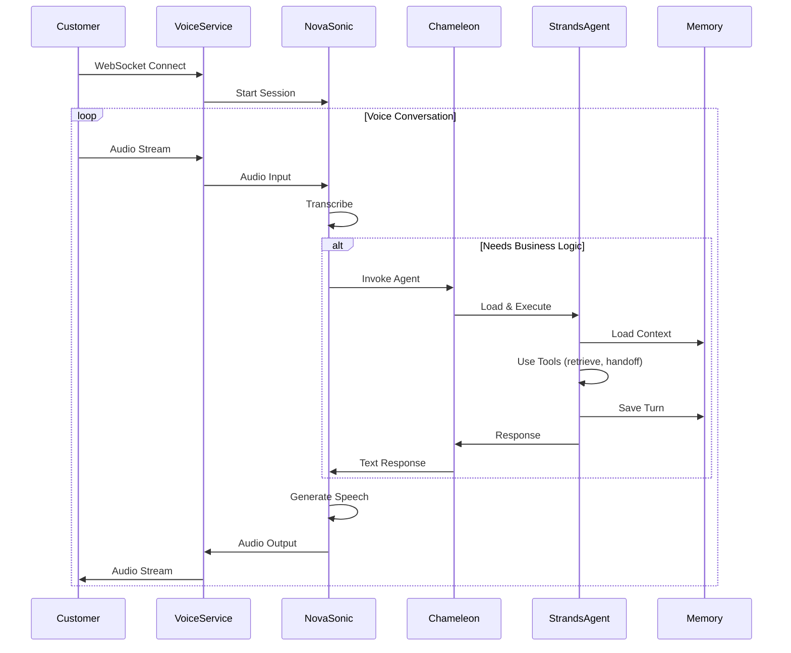
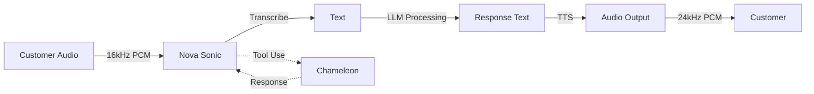

# 🎙️ Voice Agents with AWS Nova Sonic

How Oratio enables real-time voice conversations using AWS Bedrock Nova Sonic and Strands agents.

---

## Overview

Oratio voice agents provide natural phone-like conversations by combining:
- **AWS Nova Sonic** - Real-time voice-to-voice AI model (transcription + TTS)
- **Strands Agents** - Business logic and tool execution
- **Chameleon Loader** - Dynamic agent code loading
- **AgentCore Memory** - Conversation continuity across calls

**Key Advantage:** Same agent code powers both text chat and voice calls—no separate implementation needed.



---

## Architecture Components

### 1. **Voice Service (WebSocket Server)**

Manages real-time audio streaming between customers and Nova Sonic:

**Responsibilities:**
- Accept WebSocket connections from customers
- Stream audio to/from Nova Sonic bidirectionally
- Handle session lifecycle (start, maintain, end)
- Coordinate tool invocations with Chameleon

**Technical Details:**
- **Input Audio:** 16kHz PCM, base64 encoded
- **Output Audio:** 24kHz PCM, base64 encoded
- **Protocol:** WebSocket for low-latency streaming
- **Encoding:** Base64 for binary audio transmission

---

### 2. **Nova Sonic Integration**

AWS Bedrock Nova Sonic provides end-to-end voice AI:



**Event Flow:**
1. **Session Start** - Initialize conversation with Nova Sonic
2. **Prompt Start** - Configure audio format and available tools
3. **Content Start** - Begin audio input stream
4. **Audio Input** - Stream customer audio chunks
5. **Content End** - Signal end of customer speech
6. **Tool Use** (optional) - Invoke Strands agent via Chameleon for business logic
7. **Audio Output** - Receive synthesized speech response
8. **Prompt End** - Complete conversation turn
9. **Session End** - Close conversation

**Tool Configuration:**
Nova Sonic is configured with a tool called `invoke_strands_agent` that allows it to call Chameleon when business logic is needed (e.g., checking appointment availability, looking up order status).

---

### 3. **Chameleon as Tool**

Nova Sonic invokes Chameleon when it needs business logic (e.g., database queries, API calls, complex decision-making).

**Integration Flow:**
1. Nova Sonic detects need for business logic during conversation
2. Calls `invoke_strands_agent` tool with customer query
3. Tool invokes Chameleon via Bedrock Agent Runtime API
4. Chameleon loads the specific agent code from S3
5. Strands agent executes with its tools:
   - `retrieve` - Query knowledge base
   - `handoff_to_user` - Escalate to human
   - Custom tools (future: appointment booking, order lookup)
6. Response returned to Nova Sonic
7. Nova Sonic synthesizes speech and streams to customer

**Why This Works:**
- Same agent code used for text and voice
- No duplication of business logic
- Consistent behavior across channels
- Easy to update (just update S3 code)

---

### 4. **Memory Integration**

Conversation history is maintained across voice calls:

```python
# In Chameleon (generic_loader.py)
if agent_memory_id:
    # Create memory hook
    memory_hook = MemoryHookProvider(memory_client, agent_memory_id)
    
    # Set state for agent
    state = {
        "actor_id": actor_id,      # End customer ID
        "session_id": session_id   # Conversation ID
    }
    
    # Inject into agent
    agent = create_agent(hooks=[memory_hook], state=state)
```

**Memory Hook Behavior:**
- **On Agent Init**: Load last 10 conversation turns
- **On Message Added**: Save turn to memory
- **Retention**: 30 days
- **Isolation**: Per-agent, per-actor, per-session

---

## Voice Agent Workflow

### **Step 1: Customer Initiates Call**

```javascript
// Frontend WebSocket connection
const ws = new WebSocket(
  `wss://api.oratio.io/voice/${agentId}/${actorId}/${sessionId}`
);

// Stream microphone audio
navigator.mediaDevices.getUserMedia({ audio: true })
  .then(stream => {
    const mediaRecorder = new MediaRecorder(stream);
    mediaRecorder.ondataavailable = (event) => {
      ws.send(event.data); // Send audio chunks
    };
  });
```

### **Step 2: Voice Service Processes Audio**

```python
# Receive audio from customer
audio_chunk = await websocket.receive_bytes()

# Send to Nova Sonic
audio_event = {
    "event": {
        "audioInput": {
            "promptName": prompt_id,
            "contentName": content_id,
            "content": base64.b64encode(audio_chunk).decode('utf-8')
        }
    }
}
await send_to_nova_sonic(audio_event)
```

### **Step 3: Nova Sonic Processes & Responds**

```python
# Receive from Nova Sonic
response = await nova_sonic_stream.receive()

if 'audioOutput' in response['event']:
    # Speech output
    audio_bytes = base64.b64decode(response['event']['audioOutput']['content'])
    await websocket.send_bytes(audio_bytes)

elif 'toolUse' in response['event']:
    # Business logic needed
    tool_name = response['event']['toolUse']['name']
    tool_input = response['event']['toolUse']['input']
    
    # Invoke Chameleon
    result = await invoke_strands_agent_tool(
        query=tool_input['query'],
        agent_id=agent_id,
        actor_id=actor_id,
        session_id=session_id
    )
    
    # Send result back to Nova Sonic
    await send_tool_result(result)
```

### **Step 4: Strands Agent Executes**

```python
# Generated agent code (loaded by Chameleon)
def create_agent(hooks=None, state=None):
    return Agent(
        model="bedrock/amazon.nova-pro-v1:0",
        system_prompt="You help customers book appointments.",
        tools=[retrieve, handoff_to_user, check_availability, book_appointment],
        hooks=hooks or [],  # Memory hooks injected
        state=state or {}   # actor_id, session_id injected
    )

def invoke(payload, context, hooks=None, state=None):
    agent = create_agent(hooks=hooks, state=state)
    user_message = payload.get('prompt')
    
    # Agent uses tools and memory automatically
    response = agent(user_message)
    return {'output': str(response)}
```

---

## Key Differences: Voice vs Text

| Aspect | Text Chat | Voice Agent |
|--------|-----------|-------------|
| **Protocol** | REST API | WebSocket |
| **Input** | Text string | Audio stream (16kHz PCM) |
| **Output** | Text string | Audio stream (24kHz PCM) |
| **Latency** | ~1-2s | ~500ms (streaming) |
| **Model** | Nova Pro / Claude | Nova Sonic |
| **Tool Use** | Direct in agent | Via Nova Sonic tool calling |
| **Memory** | Same (AgentCore Memory) | Same (AgentCore Memory) |

---

## Voice-Optimized System Prompts

AgentCreator generates voice-specific prompts:

```python
# Generated by AgentCreator
voice_prompt = """
You are a friendly appointment booking assistant.

VOICE GUIDELINES:
- Keep responses concise (1-2 sentences)
- Use natural, conversational language
- Avoid technical jargon
- Confirm actions verbally ("I've booked your appointment for...")
- Ask clarifying questions one at a time

TOOLS:
- check_availability: Check open slots
- book_appointment: Confirm booking
- handoff_to_user: Escalate to human

ESCALATION TRIGGERS:
- Customer frustration or anger
- Complex requests requiring human judgment
- Technical issues with booking system
"""
```

---

## Testing Voice Agents

### **Local Testing (WebSocket Client)**

```python
import asyncio
import websockets
import pyaudio

async def test_voice_agent():
    uri = "ws://localhost:8001/voice/agent-123/customer-456/session-789"
    
    async with websockets.connect(uri) as websocket:
        # Send audio
        audio = pyaudio.PyAudio()
        stream = audio.open(format=pyaudio.paInt16, channels=1, rate=16000, input=True)
        
        while True:
            audio_chunk = stream.read(1024)
            await websocket.send(audio_chunk)
            
            # Receive audio
            response = await websocket.recv()
            # Play response audio...

asyncio.run(test_voice_agent())
```

### **Production Testing**

1. Deploy voice service to AWS
2. Test with real phone number (Twilio integration)
3. Monitor CloudWatch logs for errors
4. Check memory persistence across calls

---

## Performance Considerations

### **Latency Optimization**
- Use streaming for both input and output
- Keep tool responses under 2 seconds
- Cache frequently accessed data in agent code

### **Cost Optimization**
- Nova Sonic charges per audio minute
- Use text chat for non-urgent queries
- Implement session timeouts (5 min idle)

### **Scalability**
- WebSocket connections scale horizontally
- Chameleon handles concurrent agent invocations
- Memory API supports high throughput

---

## Future Enhancements

- [ ] Phone number integration (Twilio/AWS Connect)
- [ ] Multi-language support (Nova Sonic supports 20+ languages)
- [ ] Voice analytics (sentiment, interruptions, call duration)
- [ ] Real-time transcription display in dashboard

---

## Related Documentation

- [Deployment Guide](DEPLOYMENT.md) - Deploy voice service
- [Architecture](ORATIO_ARCHITECTURE.md) - System design
- [Chameleon Loader](../agent-creator/generic_loader.py) - Runtime code

---

**Questions?** Check the main [README](../README.md) or open an issue.
